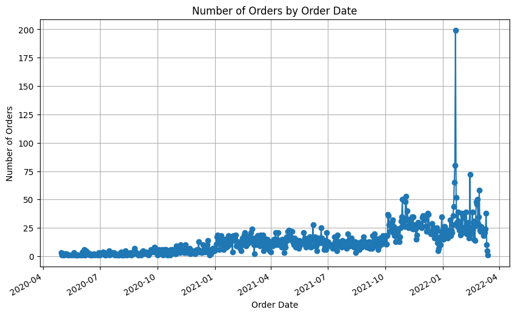
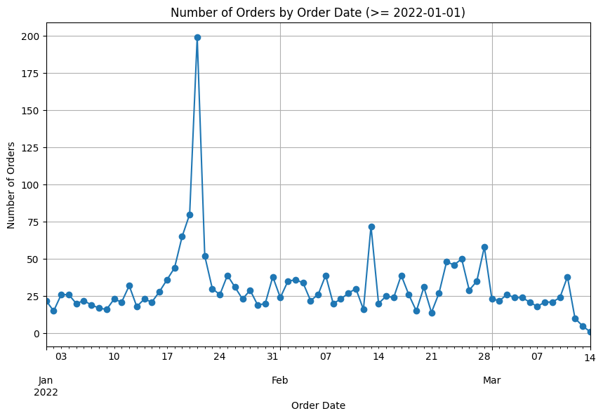
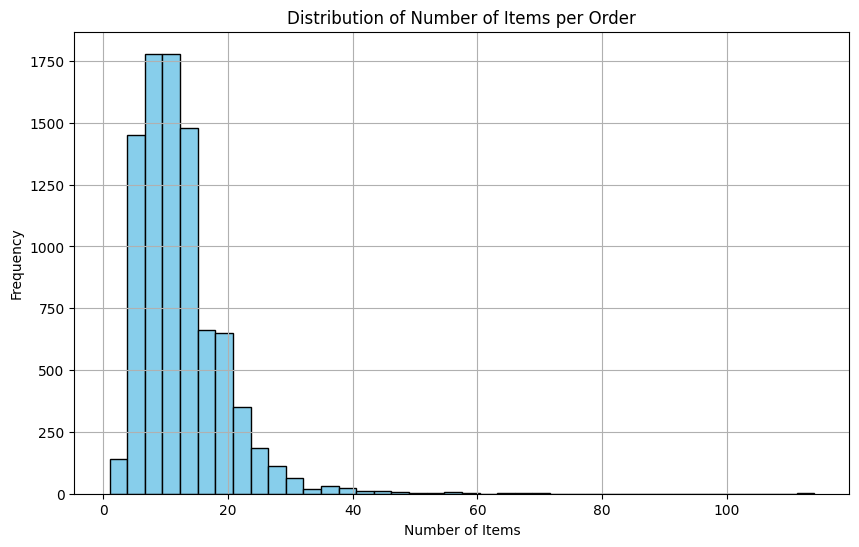
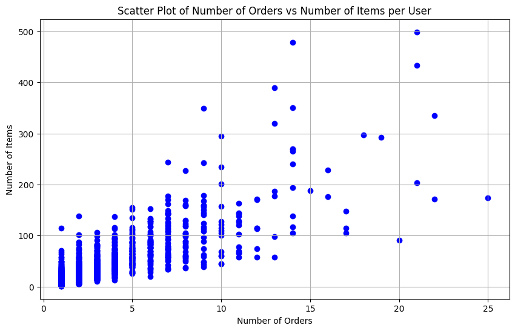
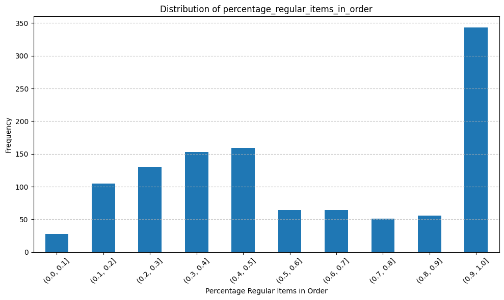
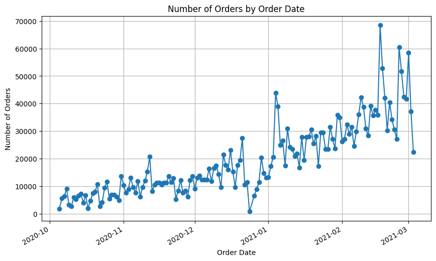
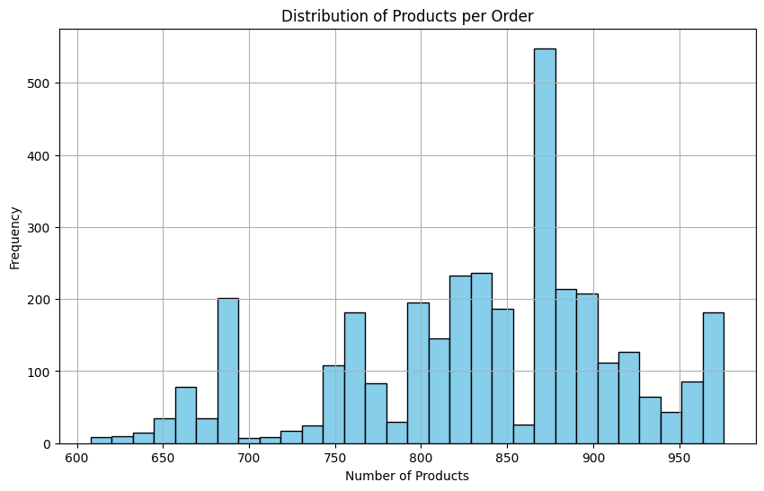
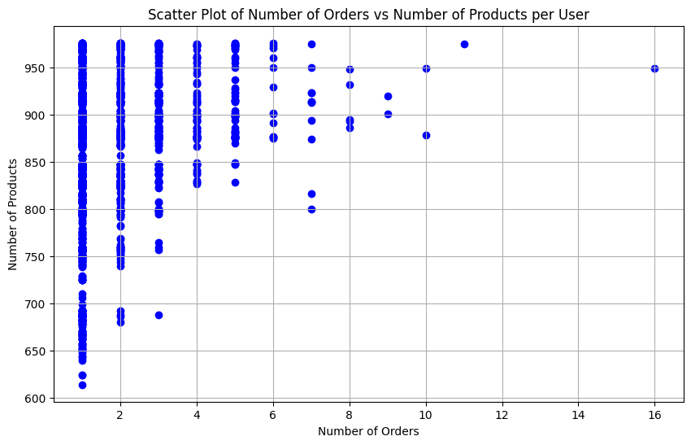

# 1. Understanding the problem space


```python
import boto3
import pandas as pd
import numpy as np
import fastparquet
import matplotlib.pyplot as plt
import subprocess
import seaborn as sns
```


```python
bucket_name = 'zrive-ds-data'
keys = ['groceries/sampled-datasets/orders.parquet', 'groceries/sampled-datasets/regulars.parquet', 'groceries/sampled-datasets/inventory.parquet', 'groceries/sampled-datasets/users.parquet']
local_file_paths = ['/home/ebacigalupe/zrive-ds/zrive-ds/orders.parquet', '/home/ebacigalupe/zrive-ds/zrive-ds/regulars.parquet', '/home/ebacigalupe/zrive-ds/zrive-ds/inventory.parquet', '/home/ebacigalupe/zrive-ds/zrive-ds/users.parquet']
datasets = ['orders', 'regulars', 'inventory', 'users']

for key, local_file_path, dataset in zip(keys, local_file_paths, datasets):
    s3 = boto3.client('s3', aws_access_key_id=access_key_id, aws_secret_access_key=secret_access_key)
    s3.download_file(bucket_name, key, local_file_path)
    df = pd.read_parquet(local_file_path)
    globals()[f"{dataset}_df"] = df

```

Abandoned_cart seems not to be available


```python
s3 = boto3.client('s3', aws_access_key_id=access_key_id, aws_secret_access_key=secret_access_key)

bucket_name = 'zrive-ds-data'
key = 'groceries/sampled-datasets/abandoned_cart.parquet'  
local_file_path = '/home/ebacigalupe/zrive-ds/zrive-ds/abandoned_cart.parquet'  

# Download the Parquet file from S3 to the local file path
s3.download_file(bucket_name, key, local_file_path)

# Read the Parquet file into a DataFrame
abandoned_cart_df = pd.read_parquet(local_file_path)

# Now you have the 'orders' DataFrame ready to use
print(abandoned_cart_df.head())
```


    ---------------------------------------------------------------------------

    ClientError                               Traceback (most recent call last)

    Cell In[6], line 11
          8 local_file_path = '/home/ebacigalupe/zrive-ds/zrive-ds/abandoned_cart.parquet'  
         10 # Download the Parquet file from S3 to the local file path
    ---> 11 s3.download_file(bucket_name, key, local_file_path)
         13 # Read the Parquet file into a DataFrame
         14 abandoned_cart_df = pd.read_parquet(local_file_path)


    File ~/.cache/pypoetry/virtualenvs/zrive-ds-djxvuVXx-py3.11/lib/python3.11/site-packages/boto3/s3/inject.py:192, in download_file(self, Bucket, Key, Filename, ExtraArgs, Callback, Config)
        157 """Download an S3 object to a file.
        158 
        159 Usage::
       (...)
        189     transfer.
        190 """
        191 with S3Transfer(self, Config) as transfer:
    --> 192     return transfer.download_file(
        193         bucket=Bucket,
        194         key=Key,
        195         filename=Filename,
        196         extra_args=ExtraArgs,
        197         callback=Callback,
        198     )


    File ~/.cache/pypoetry/virtualenvs/zrive-ds-djxvuVXx-py3.11/lib/python3.11/site-packages/boto3/s3/transfer.py:405, in S3Transfer.download_file(self, bucket, key, filename, extra_args, callback)
        401 future = self._manager.download(
        402     bucket, key, filename, extra_args, subscribers
        403 )
        404 try:
    --> 405     future.result()
        406 # This is for backwards compatibility where when retries are
        407 # exceeded we need to throw the same error from boto3 instead of
        408 # s3transfer's built in RetriesExceededError as current users are
        409 # catching the boto3 one instead of the s3transfer exception to do
        410 # their own retries.
        411 except S3TransferRetriesExceededError as e:


    File ~/.cache/pypoetry/virtualenvs/zrive-ds-djxvuVXx-py3.11/lib/python3.11/site-packages/s3transfer/futures.py:103, in TransferFuture.result(self)
         98 def result(self):
         99     try:
        100         # Usually the result() method blocks until the transfer is done,
        101         # however if a KeyboardInterrupt is raised we want want to exit
        102         # out of this and propagate the exception.
    --> 103         return self._coordinator.result()
        104     except KeyboardInterrupt as e:
        105         self.cancel()


    File ~/.cache/pypoetry/virtualenvs/zrive-ds-djxvuVXx-py3.11/lib/python3.11/site-packages/s3transfer/futures.py:266, in TransferCoordinator.result(self)
        263 # Once done waiting, raise an exception if present or return the
        264 # final result.
        265 if self._exception:
    --> 266     raise self._exception
        267 return self._result


    File ~/.cache/pypoetry/virtualenvs/zrive-ds-djxvuVXx-py3.11/lib/python3.11/site-packages/s3transfer/tasks.py:269, in SubmissionTask._main(self, transfer_future, **kwargs)
        265     self._transfer_coordinator.set_status_to_running()
        267     # Call the submit method to start submitting tasks to execute the
        268     # transfer.
    --> 269     self._submit(transfer_future=transfer_future, **kwargs)
        270 except BaseException as e:
        271     # If there was an exception raised during the submission of task
        272     # there is a chance that the final task that signals if a transfer
       (...)
        281 
        282     # Set the exception, that caused the process to fail.
        283     self._log_and_set_exception(e)


    File ~/.cache/pypoetry/virtualenvs/zrive-ds-djxvuVXx-py3.11/lib/python3.11/site-packages/s3transfer/download.py:354, in DownloadSubmissionTask._submit(self, client, config, osutil, request_executor, io_executor, transfer_future, bandwidth_limiter)
        325 """
        326 :param client: The client associated with the transfer manager
        327 
       (...)
        349     downloading streams
        350 """
        351 if transfer_future.meta.size is None:
        352     # If a size was not provided figure out the size for the
        353     # user.
    --> 354     response = client.head_object(
        355         Bucket=transfer_future.meta.call_args.bucket,
        356         Key=transfer_future.meta.call_args.key,
        357         **transfer_future.meta.call_args.extra_args,
        358     )
        359     transfer_future.meta.provide_transfer_size(
        360         response['ContentLength']
        361     )
        363 download_output_manager = self._get_download_output_manager_cls(
        364     transfer_future, osutil
        365 )(osutil, self._transfer_coordinator, io_executor)


    File ~/.cache/pypoetry/virtualenvs/zrive-ds-djxvuVXx-py3.11/lib/python3.11/site-packages/botocore/client.py:565, in ClientCreator._create_api_method.<locals>._api_call(self, *args, **kwargs)
        561     raise TypeError(
        562         f"{py_operation_name}() only accepts keyword arguments."
        563     )
        564 # The "self" in this scope is referring to the BaseClient.
    --> 565 return self._make_api_call(operation_name, kwargs)


    File ~/.cache/pypoetry/virtualenvs/zrive-ds-djxvuVXx-py3.11/lib/python3.11/site-packages/botocore/client.py:1021, in BaseClient._make_api_call(self, operation_name, api_params)
       1017     error_code = error_info.get("QueryErrorCode") or error_info.get(
       1018         "Code"
       1019     )
       1020     error_class = self.exceptions.from_code(error_code)
    -> 1021     raise error_class(parsed_response, operation_name)
       1022 else:
       1023     return parsed_response


    ClientError: An error occurred (404) when calling the HeadObject operation: Not Found


### 1. Do all the quick checks and find any potential issues with the data. Fix them as you see fit


```python
print("ORDERS")
print('1. Shape and size of orders_df \n{}: {}'.format(orders_df.shape, ', '.join(orders_df.columns)), f"\n")

print(f"2. Null values and data types: \n")
null_values = orders_df.info()

unique_users = len(orders_df['user_id'].unique())
unique_orders = len(orders_df['id'].unique())

print(f"\n", f"3. Total of {unique_orders}", f"orders made by {unique_users}", "unique users")
```

    ORDERS
    1. Shape and size of orders_df 
    (8773, 6): id, user_id, created_at, order_date, user_order_seq, ordered_items 
    
    2. Null values and data types: 
    
    <class 'pandas.core.frame.DataFrame'>
    Index: 8773 entries, 10 to 64538
    Data columns (total 6 columns):
     #   Column          Non-Null Count  Dtype         
    ---  ------          --------------  -----         
     0   id              8773 non-null   int64         
     1   user_id         8773 non-null   object        
     2   created_at      8773 non-null   datetime64[ns]
     3   order_date      8773 non-null   datetime64[ns]
     4   user_order_seq  8773 non-null   int64         
     5   ordered_items   8773 non-null   object        
    dtypes: datetime64[ns](2), int64(2), object(2)
    memory usage: 479.8+ KB
    
     3. Total of 8773 orders made by 4983 unique users


```python
print("REGULARS")
print('1. Shape and size of regulars_df \n{}: {}'.format(regulars_df.shape, ', '.join(regulars_df.columns)), f"\n")

print(f"2. Null values and data types: \n")
null_values = regulars_df.info()

unique_users = len(regulars_df['user_id'].unique())
unique_items = len(regulars_df['variant_id'].unique())

print(f"\n", f"3. Total of {unique_items}", f"unique items regularly bought by {unique_users}", "unique users")

```

    REGULARS
    1. Shape and size of regulars_df 
    (18105, 3): user_id, variant_id, created_at 
    
    2. Null values and data types: 
    
    <class 'pandas.core.frame.DataFrame'>
    Index: 18105 entries, 3 to 37720
    Data columns (total 3 columns):
     #   Column      Non-Null Count  Dtype         
    ---  ------      --------------  -----         
     0   user_id     18105 non-null  object        
     1   variant_id  18105 non-null  int64         
     2   created_at  18105 non-null  datetime64[ns]
    dtypes: datetime64[ns](1), int64(1), object(1)
    memory usage: 565.8+ KB
    
     3. Total of 1843 unique items regularly bought by 1448 unique users


```python
print("INVENTORY")
print('1. Shape and size of inventory_df \n{}: {}'.format(inventory_df.shape, ', '.join(inventory_df.columns)), f"\n")

print(f"2. Null values and data types: \n")
null_values = inventory_df.info()

unique_product_type = len(inventory_df['product_type'].unique())
unique_items = len(inventory_df['variant_id'].unique())

print(f"\n", f"3. Total of {unique_items}", f"unique items among {unique_product_type}", "unique categories")
```

    INVENTORY
    1. Shape and size of inventory_df 
    (1733, 6): variant_id, price, compare_at_price, vendor, product_type, tags 
    
    2. Null values and data types: 
    
    <class 'pandas.core.frame.DataFrame'>
    RangeIndex: 1733 entries, 0 to 1732
    Data columns (total 6 columns):
     #   Column            Non-Null Count  Dtype  
    ---  ------            --------------  -----  
     0   variant_id        1733 non-null   int64  
     1   price             1733 non-null   float64
     2   compare_at_price  1733 non-null   float64
     3   vendor            1733 non-null   object 
     4   product_type      1733 non-null   object 
     5   tags              1733 non-null   object 
    dtypes: float64(2), int64(1), object(3)
    memory usage: 81.4+ KB
    
     3. Total of 1733 unique items among 59 unique categories


```python
print("USERS")
print('1. Shape and size of users_df \n{}: {}'.format(users_df.shape, ', '.join(users_df.columns)), f"\n")

print(f"2. Null values and data types: \n")
null_values = users_df.info()

unique_users = len(users_df['user_id'].unique())
unique_segments = len(users_df['user_segment'].unique())

print(f"\n", f"3. Total of {unique_users}", f"unique users among {unique_segments}", "unique segments")
```

    USERS
    1. Shape and size of users_df 
    (4983, 10): user_id, user_segment, user_nuts1, first_ordered_at, customer_cohort_month, count_people, count_adults, count_children, count_babies, count_pets 
    
    2. Null values and data types: 
    
    <class 'pandas.core.frame.DataFrame'>
    Index: 4983 entries, 2160 to 3360
    Data columns (total 10 columns):
     #   Column                 Non-Null Count  Dtype  
    ---  ------                 --------------  -----  
     0   user_id                4983 non-null   object 
     1   user_segment           4983 non-null   object 
     2   user_nuts1             4932 non-null   object 
     3   first_ordered_at       4983 non-null   object 
     4   customer_cohort_month  4983 non-null   object 
     5   count_people           325 non-null    float64
     6   count_adults           325 non-null    float64
     7   count_children         325 non-null    float64
     8   count_babies           325 non-null    float64
     9   count_pets             325 non-null    float64
    dtypes: float64(5), object(5)
    memory usage: 428.2+ KB
    
     3. Total of 4983 unique users among 2 unique segments


### 2. Understand the problem at hand through data interrogation and hypothesis testing.

ORDERS:
1. Daily orders


```python
orders_df['order_date'] = pd.to_datetime(orders_df['order_date'])
orders_df.groupby('order_date')['id'].count().plot(kind='line', marker='o', figsize=(10, 6))
plt.title('Number of Orders by Order Date')
plt.xlabel('Order Date')
plt.ylabel('Number of Orders')
plt.grid(True)
plt.show()
```


    

    


There is an obvious outlier. Let's get deeper to see where it happened and try to undsertand why:


```python
# Filter orders with order_date >= '2022-01-01'
orders_df_2022 = orders_df[orders_df['order_date'] >= '2022-01-01']

# Plot 2022 values number of orders by order date
orders_df_2022.groupby('order_date')['id'].count().plot(kind='line', marker='o', figsize=(10, 6))
plt.title('Number of Orders by Order Date (>= 2022-01-01)')
plt.xlabel('Order Date')
plt.ylabel('Number of Orders')
plt.grid(True)
plt.show()
```


    

    


```python
# Number of orders per day in outliar period
orders_df['order_date'] = pd.to_datetime(orders_df['order_date'])
orders_df_jan_2022 = orders_df[(orders_df['order_date'] >= '2022-01-15') & (orders_df['order_date'] <= '2022-01-24')]
orders_df_jan_2022 = orders_df_jan_2022.groupby('order_date')['id'].count()
orders_df_jan_2022
```


    order_date
    2022-01-15     21
    2022-01-16     28
    2022-01-17     36
    2022-01-18     44
    2022-01-19     65
    2022-01-20     80
    2022-01-21    199
    2022-01-22     52
    2022-01-23     30
    2022-01-24     26
    Name: id, dtype: int64


There is a peaky in orders between 2022-01-15 and 2022-01-24. The outlier value of 2022-01-21 is not going to be removed since it can be due to seasonality (i.e. sales in grocery store in that period, event in the city, etc) that can be repeated. 

2. Number of items per order


```python
items_per_order = orders_df.groupby('id')['ordered_items'].apply(lambda x: sum(len(item) for item in x)).reset_index(name='num_items')
items_per_order_sorted = items_per_order.sort_values(by='num_items', ascending=False)
items_per_order_sorted.head(20)

```


<div>
<style scoped>
    .dataframe tbody tr th:only-of-type {
        vertical-align: middle;
    }

    .dataframe tbody tr th {
        vertical-align: top;
    }

    .dataframe thead th {
        text-align: right;
    }
</style>
<table border="1" class="dataframe">
  <thead>
    <tr style="text-align: right;">
      <th></th>
      <th>id</th>
      <th>num_items</th>
    </tr>
  </thead>
  <tbody>
    <tr>
      <th>6651</th>
      <td>3947934548100</td>
      <td>114</td>
    </tr>
    <tr>
      <th>3986</th>
      <td>3822639513732</td>
      <td>71</td>
    </tr>
    <tr>
      <th>2805</th>
      <td>3730902712452</td>
      <td>70</td>
    </tr>
    <tr>
      <th>3144</th>
      <td>3752334098564</td>
      <td>68</td>
    </tr>
    <tr>
      <th>776</th>
      <td>2888290697348</td>
      <td>67</td>
    </tr>
    <tr>
      <th>1359</th>
      <td>2925036404868</td>
      <td>67</td>
    </tr>
    <tr>
      <th>520</th>
      <td>2845041393796</td>
      <td>64</td>
    </tr>
    <tr>
      <th>2468</th>
      <td>3706182467716</td>
      <td>64</td>
    </tr>
    <tr>
      <th>3821</th>
      <td>3809078837380</td>
      <td>58</td>
    </tr>
    <tr>
      <th>2064</th>
      <td>3679233245316</td>
      <td>57</td>
    </tr>
    <tr>
      <th>2558</th>
      <td>3713535082628</td>
      <td>56</td>
    </tr>
    <tr>
      <th>902</th>
      <td>2896368140420</td>
      <td>56</td>
    </tr>
    <tr>
      <th>1974</th>
      <td>3673682739332</td>
      <td>55</td>
    </tr>
    <tr>
      <th>7997</th>
      <td>3994071728260</td>
      <td>55</td>
    </tr>
    <tr>
      <th>6625</th>
      <td>3946937909380</td>
      <td>54</td>
    </tr>
    <tr>
      <th>8686</th>
      <td>4022169960580</td>
      <td>54</td>
    </tr>
    <tr>
      <th>249</th>
      <td>2798488158340</td>
      <td>52</td>
    </tr>
    <tr>
      <th>4163</th>
      <td>3836507750532</td>
      <td>51</td>
    </tr>
    <tr>
      <th>2166</th>
      <td>3687694303364</td>
      <td>51</td>
    </tr>
    <tr>
      <th>1722</th>
      <td>3654969294980</td>
      <td>50</td>
    </tr>
  </tbody>
</table>
</div>


Let's analyze the distribution of number of items per order


```python
plt.figure(figsize=(10, 6))
plt.hist(items_per_order_sorted['num_items'], bins=40, color='skyblue', edgecolor='black')
plt.title('Distribution of Number of Items per Order')
plt.xlabel('Number of Items')
plt.ylabel('Frequency')
plt.grid(True)
plt.show()
```


    

    


We also obtain basic statistical information to understand the distribution


```python
stat_info = items_per_order_sorted['num_items'].describe()
most_repeated_value = items_per_order_sorted['num_items'].mode()

print("Basic Statistical Information:")
print(stat_info)
print("\nMost Repeated Value:")
print(most_repeated_value)
```

    Basic Statistical Information:
    count    8773.000000
    mean       12.305711
    std         6.839507
    min         1.000000
    25%         8.000000
    50%        11.000000
    75%        15.000000
    max       114.000000
    Name: num_items, dtype: float64
    
    Most Repeated Value:
    0    10
    Name: num_items, dtype: int64


3. Number of orders and number of items per user_id. Lets plot the user_ids in a scatter plot to see the distribution between number of orders and number of items


```python
orders_per_user = orders_df.groupby('user_id').agg(num_orders=('id', 'count'), num_items=('ordered_items', lambda x: sum(len(item) for item in x))).reset_index()

plt.figure(figsize=(10, 6))
plt.scatter(orders_per_user['num_orders'], orders_per_user['num_items'], color='blue')

plt.title('Scatter Plot of Number of Orders vs Number of Items per User')
plt.xlabel('Number of Orders')
plt.ylabel('Number of Items')
plt.grid(True)
plt.show()
```


    

    


We can use this later to segment the customers by number of times they buy and the amount of products they take

REGULARS:
1. Are regular items the most frequently item bought by users?
We are joining orders_df and regulars_df to try to answer this question


```python
# Perform a left join between orders_df and regulars_df on the 'user_id' column
orders_vs_regular_df = pd.merge(orders_df, regulars_df[['user_id', 'variant_id']], on='user_id', how='left')
orders_vs_regular_df.head()
```


<div>
<style scoped>
    .dataframe tbody tr th:only-of-type {
        vertical-align: middle;
    }

    .dataframe tbody tr th {
        vertical-align: top;
    }

    .dataframe thead th {
        text-align: right;
    }
</style>
<table border="1" class="dataframe">
  <thead>
    <tr style="text-align: right;">
      <th></th>
      <th>id</th>
      <th>user_id</th>
      <th>created_at</th>
      <th>order_date</th>
      <th>user_order_seq</th>
      <th>ordered_items</th>
      <th>variant_id</th>
    </tr>
  </thead>
  <tbody>
    <tr>
      <th>0</th>
      <td>2204073066628</td>
      <td>62e271062eb827e411bd73941178d29b022f5f2de9d37f...</td>
      <td>2020-04-30 14:32:19</td>
      <td>2020-04-30</td>
      <td>1</td>
      <td>[33618849693828, 33618860179588, 3361887404045...</td>
      <td>3.361891e+13</td>
    </tr>
    <tr>
      <th>1</th>
      <td>2204073066628</td>
      <td>62e271062eb827e411bd73941178d29b022f5f2de9d37f...</td>
      <td>2020-04-30 14:32:19</td>
      <td>2020-04-30</td>
      <td>1</td>
      <td>[33618849693828, 33618860179588, 3361887404045...</td>
      <td>3.361898e+13</td>
    </tr>
    <tr>
      <th>2</th>
      <td>2204073066628</td>
      <td>62e271062eb827e411bd73941178d29b022f5f2de9d37f...</td>
      <td>2020-04-30 14:32:19</td>
      <td>2020-04-30</td>
      <td>1</td>
      <td>[33618849693828, 33618860179588, 3361887404045...</td>
      <td>3.361886e+13</td>
    </tr>
    <tr>
      <th>3</th>
      <td>2204073066628</td>
      <td>62e271062eb827e411bd73941178d29b022f5f2de9d37f...</td>
      <td>2020-04-30 14:32:19</td>
      <td>2020-04-30</td>
      <td>1</td>
      <td>[33618849693828, 33618860179588, 3361887404045...</td>
      <td>3.361887e+13</td>
    </tr>
    <tr>
      <th>4</th>
      <td>2204073066628</td>
      <td>62e271062eb827e411bd73941178d29b022f5f2de9d37f...</td>
      <td>2020-04-30 14:32:19</td>
      <td>2020-04-30</td>
      <td>1</td>
      <td>[33618849693828, 33618860179588, 3361887404045...</td>
      <td>3.361890e+13</td>
    </tr>
  </tbody>
</table>
</div>


```python
# 1. Count how many variant_id are per user_id and see if we have null values
orders_vs_regular_df['regular_items'] = orders_vs_regular_df.groupby('user_id')['variant_id'].transform(lambda x: list(x))

print(f"Orders with no regular items: {orders_vs_regular_df['regular_items'].isnull().sum()}")
print(f"Orders with regular items: {orders_vs_regular_df['regular_items'].notnull().sum()}")
```

    Orders with no regular items: 4748
    Orders with regular items: 80176


Since I want to analyze the frecuency of regular products, I will remove null values. Null values do not give me any information


```python
orders_vs_regular_df.dropna(subset=['regular_items'], inplace=True)
print(f"Orders with no regular items: {orders_vs_regular_df['regular_items'].isnull().sum()}")
print(f"Orders with regular items: {orders_vs_regular_df['regular_items'].notnull().sum()}")
```

    Orders with no regular items: 0
    Orders with regular items: 80176


```python
# 2. New dataset grouped by user_id and id
grouped_df = orders_vs_regular_df.groupby(['user_id', 'id']).agg({
    'ordered_items': lambda x: list(x),
    'regular_items': lambda x: list(x)
}).reset_index()

grouped_df
```


<div>
<style scoped>
    .dataframe tbody tr th:only-of-type {
        vertical-align: middle;
    }

    .dataframe tbody tr th {
        vertical-align: top;
    }

    .dataframe thead th {
        text-align: right;
    }
</style>
<table border="1" class="dataframe">
  <thead>
    <tr style="text-align: right;">
      <th></th>
      <th>user_id</th>
      <th>id</th>
      <th>ordered_items</th>
      <th>regular_items</th>
    </tr>
  </thead>
  <tbody>
    <tr>
      <th>0</th>
      <td>004b3e3cb9a9f5b0974ce4179db394057c72e7a82077bf...</td>
      <td>3927552688260</td>
      <td>[[33667265855620, 34037939437700, 341373892363...</td>
      <td>[33667274997892.0]</td>
    </tr>
    <tr>
      <th>1</th>
      <td>004b3e3cb9a9f5b0974ce4179db394057c72e7a82077bf...</td>
      <td>3933370482820</td>
      <td>[[34198503129220, 34284951273604, 342849519617...</td>
      <td>[33667274997892.0]</td>
    </tr>
    <tr>
      <th>2</th>
      <td>004b3e3cb9a9f5b0974ce4179db394057c72e7a82077bf...</td>
      <td>3970001010820</td>
      <td>[[33826430648452, 34037939437700, 341373894329...</td>
      <td>[33667274997892.0]</td>
    </tr>
    <tr>
      <th>3</th>
      <td>005743eefffa4ce840608c4f47b8c548b134d89be5c390...</td>
      <td>3732136067204</td>
      <td>[[34081589887108, 34519123951748, 345191239517...</td>
      <td>[34081589887108.0, 34519123951748.0]</td>
    </tr>
    <tr>
      <th>4</th>
      <td>0074992079c1836c6509eec748a973dc97388b4877e770...</td>
      <td>2262514729092</td>
      <td>[[33667289514116, 33667293085828, 336672930858...</td>
      <td>[33667222896772.0, 33826414526596.0, 338264136...</td>
    </tr>
    <tr>
      <th>...</th>
      <td>...</td>
      <td>...</td>
      <td>...</td>
      <td>...</td>
    </tr>
    <tr>
      <th>4020</th>
      <td>fffd9f989509e36d1fc3e3e53627d6341482f385052a03...</td>
      <td>3911467401348</td>
      <td>[[33826432188548, 33826432548996, 342765703333...</td>
      <td>[33826413019268.0, 34465293402244.0, 395902665...</td>
    </tr>
    <tr>
      <th>4021</th>
      <td>fffd9f989509e36d1fc3e3e53627d6341482f385052a03...</td>
      <td>3934888919172</td>
      <td>[[34465293107332, 34465293336708, 344652933367...</td>
      <td>[33826413019268.0, 34465293402244.0, 395902665...</td>
    </tr>
    <tr>
      <th>4022</th>
      <td>fffd9f989509e36d1fc3e3e53627d6341482f385052a03...</td>
      <td>3962156253316</td>
      <td>[[34317850116228, 34465293107332, 344652939265...</td>
      <td>[33826413019268.0, 34465293402244.0, 395902665...</td>
    </tr>
    <tr>
      <th>4023</th>
      <td>fffd9f989509e36d1fc3e3e53627d6341482f385052a03...</td>
      <td>3978608115844</td>
      <td>[[34465293107332, 34465293336708, 344652933367...</td>
      <td>[33826413019268.0, 34465293402244.0, 395902665...</td>
    </tr>
    <tr>
      <th>4024</th>
      <td>fffd9f989509e36d1fc3e3e53627d6341482f385052a03...</td>
      <td>3999961317508</td>
      <td>[[34465293107332, 34465293336708, 344652933367...</td>
      <td>[33826413019268.0, 34465293402244.0, 395902665...</td>
    </tr>
  </tbody>
</table>
<p>4025 rows × 4 columns</p>
</div>


```python
# Calculate the number of regular products that appear in every order by customer
grouped_df['percentage_regular_items_in_order'] = 0

for i in range(len(grouped_df)):
    regulars_in_order = 0
    total_regular_items = len(grouped_df['regular_items'].iloc[i])

    for regular_item in grouped_df['regular_items'].iloc[i]:
        if regular_item in grouped_df['ordered_items'].iloc[i][0]:
            regulars_in_order += 1

    if total_regular_items > 0:
        grouped_df.at[i, 'percentage_regular_items_in_order'] = regulars_in_order / total_regular_items
    else:
        grouped_df.at[i, 'percentage_regular_items_in_order'] = 0

grouped_df.head()

```

    /tmp/ipykernel_2226/2198502452.py:13: FutureWarning: Setting an item of incompatible dtype is deprecated and will raise an error in a future version of pandas. Value '0.5416666666666666' has dtype incompatible with int64, please explicitly cast to a compatible dtype first.
      grouped_df.at[i, 'percentage_regular_items_in_order'] = regulars_in_order / total_regular_items


<div>
<style scoped>
    .dataframe tbody tr th:only-of-type {
        vertical-align: middle;
    }

    .dataframe tbody tr th {
        vertical-align: top;
    }

    .dataframe thead th {
        text-align: right;
    }
</style>
<table border="1" class="dataframe">
  <thead>
    <tr style="text-align: right;">
      <th></th>
      <th>user_id</th>
      <th>id</th>
      <th>ordered_items</th>
      <th>regular_items</th>
      <th>percentage_regular_items_in_order</th>
    </tr>
  </thead>
  <tbody>
    <tr>
      <th>0</th>
      <td>004b3e3cb9a9f5b0974ce4179db394057c72e7a82077bf...</td>
      <td>3927552688260</td>
      <td>[[33667265855620, 34037939437700, 341373892363...</td>
      <td>[33667274997892.0]</td>
      <td>0.000000</td>
    </tr>
    <tr>
      <th>1</th>
      <td>004b3e3cb9a9f5b0974ce4179db394057c72e7a82077bf...</td>
      <td>3933370482820</td>
      <td>[[34198503129220, 34284951273604, 342849519617...</td>
      <td>[33667274997892.0]</td>
      <td>0.000000</td>
    </tr>
    <tr>
      <th>2</th>
      <td>004b3e3cb9a9f5b0974ce4179db394057c72e7a82077bf...</td>
      <td>3970001010820</td>
      <td>[[33826430648452, 34037939437700, 341373894329...</td>
      <td>[33667274997892.0]</td>
      <td>0.000000</td>
    </tr>
    <tr>
      <th>3</th>
      <td>005743eefffa4ce840608c4f47b8c548b134d89be5c390...</td>
      <td>3732136067204</td>
      <td>[[34081589887108, 34519123951748, 345191239517...</td>
      <td>[34081589887108.0, 34519123951748.0]</td>
      <td>1.000000</td>
    </tr>
    <tr>
      <th>4</th>
      <td>0074992079c1836c6509eec748a973dc97388b4877e770...</td>
      <td>2262514729092</td>
      <td>[[33667289514116, 33667293085828, 336672930858...</td>
      <td>[33667222896772.0, 33826414526596.0, 338264136...</td>
      <td>0.541667</td>
    </tr>
  </tbody>
</table>
</div>


```python
grouped_df['percentage_regular_items_in_order'].describe()
```


    count    4025.000000
    mean        0.414919
    std         0.370391
    min         0.000000
    25%         0.083333
    50%         0.333333
    75%         0.714286
    max         1.000000
    Name: percentage_regular_items_in_order, dtype: float64


2. Frequency to buy regular items by user


```python
# Group by user_id and calculate the mean value of percentage
user_regular_percentage_df = grouped_df.groupby('user_id').agg({
    'percentage_regular_items_in_order': np.mean
}).reset_index()

user_regular_percentage_df.head()
```

    /tmp/ipykernel_2226/344451023.py:2: FutureWarning: The provided callable <function mean at 0x7fb6e021c720> is currently using SeriesGroupBy.mean. In a future version of pandas, the provided callable will be used directly. To keep current behavior pass the string "mean" instead.
      user_regular_percentage_df = grouped_df.groupby('user_id').agg({


<div>
<style scoped>
    .dataframe tbody tr th:only-of-type {
        vertical-align: middle;
    }

    .dataframe tbody tr th {
        vertical-align: top;
    }

    .dataframe thead th {
        text-align: right;
    }
</style>
<table border="1" class="dataframe">
  <thead>
    <tr style="text-align: right;">
      <th></th>
      <th>user_id</th>
      <th>percentage_regular_items_in_order</th>
    </tr>
  </thead>
  <tbody>
    <tr>
      <th>0</th>
      <td>004b3e3cb9a9f5b0974ce4179db394057c72e7a82077bf...</td>
      <td>0.000000</td>
    </tr>
    <tr>
      <th>1</th>
      <td>005743eefffa4ce840608c4f47b8c548b134d89be5c390...</td>
      <td>1.000000</td>
    </tr>
    <tr>
      <th>2</th>
      <td>0074992079c1836c6509eec748a973dc97388b4877e770...</td>
      <td>0.541667</td>
    </tr>
    <tr>
      <th>3</th>
      <td>00ecced73edb11d4bab08e794656dcf9d9b89ea89c5918...</td>
      <td>0.666667</td>
    </tr>
    <tr>
      <th>4</th>
      <td>014301579c18e7c7f034e544ab3d4ee235ef2de43ee5db...</td>
      <td>0.300000</td>
    </tr>
  </tbody>
</table>
</div>


Let's plot the distribution of the percentage of regular items buy by each user


```python
# Group data in 10% bins
bins = np.arange(0, 1.1, 0.1)
distribution = pd.cut(user_regular_percentage_df['percentage_regular_items_in_order'], bins=bins).value_counts().sort_index()

# Plot the distribution
plt.figure(figsize=(10, 6))
distribution.plot(kind='bar')
plt.title('Distribution of percentage_regular_items_in_order')
plt.xlabel('Percentage Regular Items in Order')
plt.ylabel('Frequency')
plt.xticks(rotation=45)
plt.grid(axis='y', linestyle='--', alpha=0.7)
plt.tight_layout()
plt.show()

```


    

    


We can say that customers buy their regular products quite often

INVENTORY:
1. Most selled products
2. What product_type is selled most?
3. Items bought together


```python

```

USERS:
1. Which user_segment spend most and in how many orders?
2. Does users individually behave as their user segment based on previous question?


```python

```

I would also try to respond the above questions, but, due to lack of time, I will continue with the rest of the assesment.

# 2. Exploratory Data Analysis


```python
local_file_path = '/home/ebacigalupe/zrive-ds/zrive-ds/feature_frame.csv'  

feature_frame = pd.read_csv(local_file_path)

feature_frame.head()
```


<div>
<style scoped>
    .dataframe tbody tr th:only-of-type {
        vertical-align: middle;
    }

    .dataframe tbody tr th {
        vertical-align: top;
    }

    .dataframe thead th {
        text-align: right;
    }
</style>
<table border="1" class="dataframe">
  <thead>
    <tr style="text-align: right;">
      <th></th>
      <th>variant_id</th>
      <th>product_type</th>
      <th>order_id</th>
      <th>user_id</th>
      <th>created_at</th>
      <th>order_date</th>
      <th>user_order_seq</th>
      <th>outcome</th>
      <th>ordered_before</th>
      <th>abandoned_before</th>
      <th>...</th>
      <th>count_children</th>
      <th>count_babies</th>
      <th>count_pets</th>
      <th>people_ex_baby</th>
      <th>days_since_purchase_variant_id</th>
      <th>avg_days_to_buy_variant_id</th>
      <th>std_days_to_buy_variant_id</th>
      <th>days_since_purchase_product_type</th>
      <th>avg_days_to_buy_product_type</th>
      <th>std_days_to_buy_product_type</th>
    </tr>
  </thead>
  <tbody>
    <tr>
      <th>0</th>
      <td>33826472919172</td>
      <td>ricepastapulses</td>
      <td>2807985930372</td>
      <td>3482464092292</td>
      <td>2020-10-05 16:46:19</td>
      <td>2020-10-05 00:00:00</td>
      <td>3</td>
      <td>0.0</td>
      <td>0.0</td>
      <td>0.0</td>
      <td>...</td>
      <td>0.0</td>
      <td>0.0</td>
      <td>0.0</td>
      <td>2.0</td>
      <td>33.0</td>
      <td>42.0</td>
      <td>31.134053</td>
      <td>30.0</td>
      <td>30.0</td>
      <td>24.27618</td>
    </tr>
    <tr>
      <th>1</th>
      <td>33826472919172</td>
      <td>ricepastapulses</td>
      <td>2808027644036</td>
      <td>3466586718340</td>
      <td>2020-10-05 17:59:51</td>
      <td>2020-10-05 00:00:00</td>
      <td>2</td>
      <td>0.0</td>
      <td>0.0</td>
      <td>0.0</td>
      <td>...</td>
      <td>0.0</td>
      <td>0.0</td>
      <td>0.0</td>
      <td>2.0</td>
      <td>33.0</td>
      <td>42.0</td>
      <td>31.134053</td>
      <td>30.0</td>
      <td>30.0</td>
      <td>24.27618</td>
    </tr>
    <tr>
      <th>2</th>
      <td>33826472919172</td>
      <td>ricepastapulses</td>
      <td>2808099078276</td>
      <td>3481384026244</td>
      <td>2020-10-05 20:08:53</td>
      <td>2020-10-05 00:00:00</td>
      <td>4</td>
      <td>0.0</td>
      <td>0.0</td>
      <td>0.0</td>
      <td>...</td>
      <td>0.0</td>
      <td>0.0</td>
      <td>0.0</td>
      <td>2.0</td>
      <td>33.0</td>
      <td>42.0</td>
      <td>31.134053</td>
      <td>30.0</td>
      <td>30.0</td>
      <td>24.27618</td>
    </tr>
    <tr>
      <th>3</th>
      <td>33826472919172</td>
      <td>ricepastapulses</td>
      <td>2808393957508</td>
      <td>3291363377284</td>
      <td>2020-10-06 08:57:59</td>
      <td>2020-10-06 00:00:00</td>
      <td>2</td>
      <td>0.0</td>
      <td>0.0</td>
      <td>0.0</td>
      <td>...</td>
      <td>0.0</td>
      <td>0.0</td>
      <td>0.0</td>
      <td>2.0</td>
      <td>33.0</td>
      <td>42.0</td>
      <td>31.134053</td>
      <td>30.0</td>
      <td>30.0</td>
      <td>24.27618</td>
    </tr>
    <tr>
      <th>4</th>
      <td>33826472919172</td>
      <td>ricepastapulses</td>
      <td>2808429314180</td>
      <td>3537167515780</td>
      <td>2020-10-06 10:37:05</td>
      <td>2020-10-06 00:00:00</td>
      <td>3</td>
      <td>0.0</td>
      <td>0.0</td>
      <td>0.0</td>
      <td>...</td>
      <td>0.0</td>
      <td>0.0</td>
      <td>0.0</td>
      <td>2.0</td>
      <td>33.0</td>
      <td>42.0</td>
      <td>31.134053</td>
      <td>30.0</td>
      <td>30.0</td>
      <td>24.27618</td>
    </tr>
  </tbody>
</table>
<p>5 rows × 27 columns</p>
</div>


#### 1. Do all the quick checks and find any potential issues with the data. Fix them as you see fit.


```python
print("FEATURE_FRAME")
print('1. Shape and size of feature_frame \n{}: {}'.format(feature_frame.shape, ', '.join(feature_frame.columns)), f"\n")

print(f"2. Data types: \n")
null_values = feature_frame.info()

unique_users = len(feature_frame['user_id'].unique())
unique_orders = len(feature_frame['order_id'].unique())
unique_products = len(feature_frame['variant_id'].unique())

```

    FEATURE_FRAME
    1. Shape and size of feature_frame 
    (2880549, 27): variant_id, product_type, order_id, user_id, created_at, order_date, user_order_seq, outcome, ordered_before, abandoned_before, active_snoozed, set_as_regular, normalised_price, discount_pct, vendor, global_popularity, count_adults, count_children, count_babies, count_pets, people_ex_baby, days_since_purchase_variant_id, avg_days_to_buy_variant_id, std_days_to_buy_variant_id, days_since_purchase_product_type, avg_days_to_buy_product_type, std_days_to_buy_product_type 
    
    2. Data types: 
    
    <class 'pandas.core.frame.DataFrame'>
    RangeIndex: 2880549 entries, 0 to 2880548
    Data columns (total 27 columns):
     #   Column                            Dtype  
    ---  ------                            -----  
     0   variant_id                        int64  
     1   product_type                      object 
     2   order_id                          int64  
     3   user_id                           int64  
     4   created_at                        object 
     5   order_date                        object 
     6   user_order_seq                    int64  
     7   outcome                           float64
     8   ordered_before                    float64
     9   abandoned_before                  float64
     10  active_snoozed                    float64
     11  set_as_regular                    float64
     12  normalised_price                  float64
     13  discount_pct                      float64
     14  vendor                            object 
     15  global_popularity                 float64
     16  count_adults                      float64
     17  count_children                    float64
     18  count_babies                      float64
     19  count_pets                        float64
     20  people_ex_baby                    float64
     21  days_since_purchase_variant_id    float64
     22  avg_days_to_buy_variant_id        float64
     23  std_days_to_buy_variant_id        float64
     24  days_since_purchase_product_type  float64
     25  avg_days_to_buy_product_type      float64
     26  std_days_to_buy_product_type      float64
    dtypes: float64(19), int64(4), object(4)
    memory usage: 593.4+ MB


```python
print(f"3. Null values: \n")
null_counts = feature_frame.isnull().sum()
print(null_counts)

print(f"\n", f"4. Total of {unique_orders}", f"orders made by {unique_users}", "unique users", f"including {unique_products}", "unique products")
```

    3. Null values: 
    
    variant_id                          0
    product_type                        0
    order_id                            0
    user_id                             0
    created_at                          0
    order_date                          0
    user_order_seq                      0
    outcome                             0
    ordered_before                      0
    abandoned_before                    0
    active_snoozed                      0
    set_as_regular                      0
    normalised_price                    0
    discount_pct                        0
    vendor                              0
    global_popularity                   0
    count_adults                        0
    count_children                      0
    count_babies                        0
    count_pets                          0
    people_ex_baby                      0
    days_since_purchase_variant_id      0
    avg_days_to_buy_variant_id          0
    std_days_to_buy_variant_id          0
    days_since_purchase_product_type    0
    avg_days_to_buy_product_type        0
    std_days_to_buy_product_type        0
    dtype: int64
    
     4. Total of 3446 orders made by 1937 unique users including 976 unique products


#### 2. Do all he data integrity checks and understand the shape of your data.


Let's analyze again the number of orders over the time


```python
feature_frame['order_date'] = pd.to_datetime(feature_frame['order_date'])
feature_frame.groupby('order_date')['order_id'].count().plot(kind='line', marker='o', figsize=(10, 6))
plt.title('Number of Orders by Order Date')
plt.xlabel('Order Date')
plt.ylabel('Number of Orders')
plt.grid(True)
plt.show()
```


    

    


Despite there are some peaks in the graph, the data seems to be following a trend.

Now, let's plot the distribution of products per order:


```python
products_per_order = feature_frame.groupby('order_id')['variant_id'].count()

plt.figure(figsize=(10, 6))
plt.hist(products_per_order, bins=30, color='skyblue', edgecolor='black')
plt.title('Distribution of Products per Order')
plt.xlabel('Number of Products')
plt.ylabel('Frequency')
plt.grid(True)
plt.show()
```


    

    


Seems to be a large number of products per order. The distribution is wavy. It can be due to natural variability of the data (customer behaviour). It can be insteresting to have those peaks in number of products per order since we wil be able to predict high selling periods or anticipate to refill stock.

We can also obtain basic statistical information to understand the distribution:


```python
stat_info = products_per_order.describe()

most_repeated_value = products_per_order.mode()

print("Basic Statistical Information:")
print(stat_info)
print("\nMost Repeated Value:")
print(most_repeated_value)
```

    Basic Statistical Information:
    count    3446.000000
    mean      835.910911
    std        81.741761
    min       608.000000
    25%       794.000000
    50%       847.000000
    75%       885.000000
    max       976.000000
    Name: variant_id, dtype: float64
    
    Most Repeated Value:
    0    877
    Name: variant_id, dtype: int64


As before, we can analyze the number of orders and number of items per user_id by plotting those metrics to see the user distribution. 


```python
orders_per_user = feature_frame.groupby('user_id').agg(num_orders=('order_id', 'nunique'), num_products=('variant_id', 'nunique')).reset_index()

plt.figure(figsize=(10, 6))
plt.scatter(orders_per_user['num_orders'], orders_per_user['num_products'], color='blue')

plt.title('Scatter Plot of Number of Orders vs Number of Products per User')
plt.xlabel('Number of Orders')
plt.ylabel('Number of Products')
plt.grid(True)
plt.show()
```


    

    


The distribution changes compared to datasets from exercise one. It can be seen that most of users that buy a large amount of products thay do it in few orders. The user that tend to buy more often (more number of orders) also tend to make smaller orders. 

To show the correlation between Number of Orders and Number of Products per User can be relevant:


```python
correlation = orders_per_user['num_orders'].corr(orders_per_user['num_products'])
print("Correlation between Number of Orders and Number of Products per User:", correlation)
```

    Correlation between Number of Orders and Number of Products per User: 0.2310344782195647


```python
# Convert non-numeric columns to numeric using one-hot encoding
feature_frame_numeric = pd.get_dummies(feature_frame)

# Drop the 'ricepastapulses' column if it exists
if 'ricepastapulses' in feature_frame_numeric.columns:
    feature_frame_numeric.drop(columns=['ricepastapulses'], inplace=True)

# Compute the correlation matrix
correlation_matrix = feature_frame_numeric.corr()

print("Correlation Matrix:")
print(correlation_matrix)


```


    The Kernel crashed while executing code in the current cell or a previous cell. 


    Please review the code in the cell(s) to identify a possible cause of the failure. 


    Click <a href='https://aka.ms/vscodeJupyterKernelCrash'>here</a> for more info. 


    View Jupyter <a href='command:jupyter.viewOutput'>log</a> for further details.

