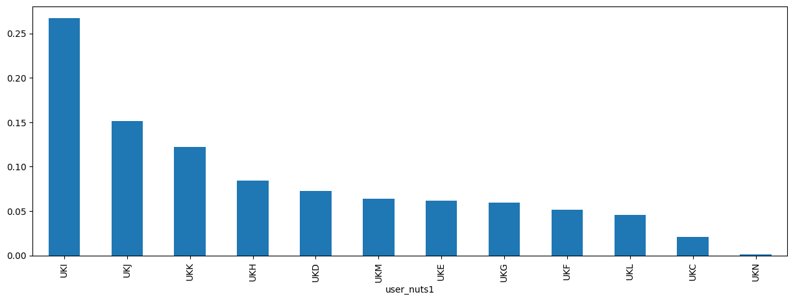
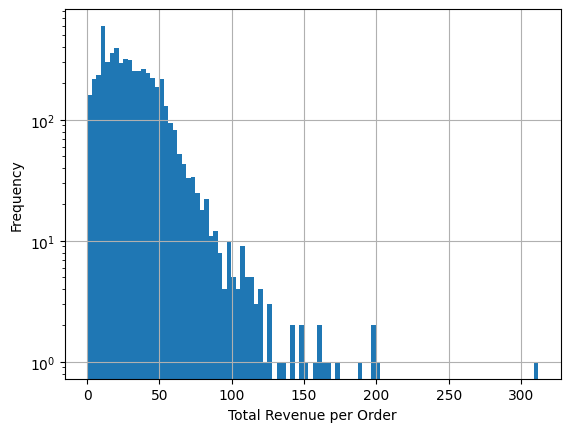
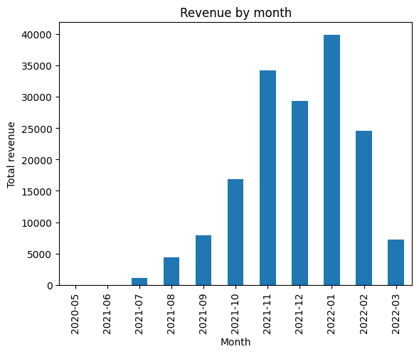
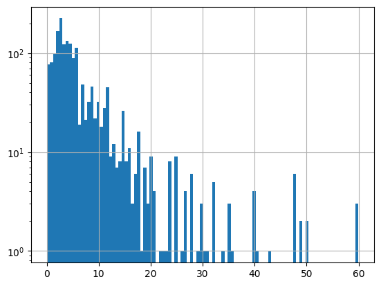
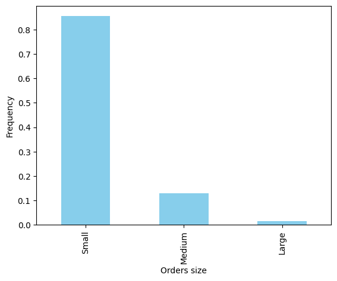
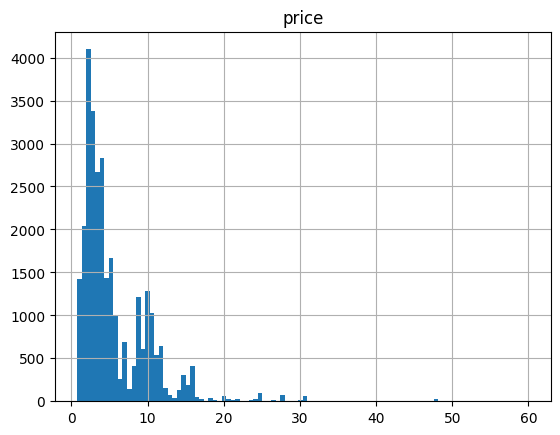

**PART1. EDA GROCERIES**

Imports


```python
# !poetry install
# !poetry add python-dotenv boto3
#!poetry add matplotlib
#!poetry add seaborn
#!poetry add plotly
import os
from dotenv import load_dotenv
import boto3
from botocore.exceptions import ClientError
import pandas as pd
import matplotlib.pyplot as plt
import seaborn as sns
import plotly.express as px
```

Downloading data


```python
# def download_parquet(bucket_name:str, s3_file_key:str, local_file_path:str) -> None:

#     s3 = boto3.client('s3',
#                       aws_access_key_id=os.getenv('AWS_ACCESS_KEY_ID'),
#                       aws_secret_access_key=os.getenv('AWS_SECRET_ACCESS_KEY'))

#     try:
#         s3.download_file(bucket_name, s3_file_key, local_file_path)
#         print(f"Successfully downloaded {s3_file_key} to {local_file_path}")
#     except ClientError as e:
#         print(f"Error downloading {s3_file_key}: {str(e)}")


# load_dotenv()
# aws_access_key_id = os.getenv('AWS_ACCESS_KEY_ID')
# aws_secret_access_key = os.getenv('AWS_SECRET_ACCESS_KEY')


# s3 = boto3.client('s3',
#                   aws_access_key_id=aws_access_key_id,
#                   aws_secret_access_key=aws_secret_access_key)
# bucket_name = 'zrive-ds-data'
# s3_prefix = 'groceries/sampled-datasets/'
# local_dir = r'/home/raquel/zrive-ds/data_groc'
# os.makedirs(local_dir, exist_ok=True)


# try:
#     response = s3.list_objects_v2(Bucket=bucket_name, Prefix=s3_prefix)

#     if 'Contents' in response:

#         for obj in response['Contents']:
#             if obj['Key'].endswith('.parquet'):
#                 file_name = os.path.basename(obj['Key'])
#                 local_file_path = os.path.join(local_dir, file_name)
#                 download_parquet(bucket_name, obj['Key'], local_file_path)
#     else:
#         print(f"The bucket {bucket_name} or the specified prefix is empty.")

# except Exception as e:
#     print(f"An error occurred: {str(e)}")
```

Importing data


```python
df_orders = pd.read_parquet(r"/home/raquel/zrive-ds/data_groc/abandoned_carts.parquet")
df_regulars = pd.read_parquet(r"/home/raquel/zrive-ds/data_groc/regulars.parquet")
df_abandoned = pd.read_parquet(
    r"/home/raquel/zrive-ds/data_groc/abandoned_carts.parquet"
)
df_inventory = pd.read_parquet(r"/home/raquel/zrive-ds/data_groc/inventory.parquet")
df_users = pd.read_parquet(r"/home/raquel/zrive-ds/data_groc/users.parquet")
```

Initial characteristics of the data's dimensions, shapes, and types


```python
dfs = {
    "df_orders": df_orders,
    "df_regulars": df_regulars,
    "df_abandoned": df_abandoned,
    "df_inventory": df_inventory,
    "df_users": df_users,
}

for name, df in dfs.items():
    print(f"{name}:")
    print(f"Forma: {df.shape}")
    print(f"Tamaño: {df.size}")
    print(f"Clases de datos (columnas y tipos):\n{df.dtypes}")
    print("\n")
```

    df_orders:
    Forma: (5457, 4)
    Tamaño: 21828
    Clases de datos (columnas y tipos):
    id                     int64
    user_id               object
    created_at    datetime64[us]
    variant_id            object
    dtype: object
    
    
    df_regulars:
    Forma: (18105, 3)
    Tamaño: 54315
    Clases de datos (columnas y tipos):
    user_id               object
    variant_id             int64
    created_at    datetime64[us]
    dtype: object
    
    
    df_abandoned:
    Forma: (5457, 4)
    Tamaño: 21828
    Clases de datos (columnas y tipos):
    id                     int64
    user_id               object
    created_at    datetime64[us]
    variant_id            object
    dtype: object
    
    
    df_inventory:
    Forma: (1733, 6)
    Tamaño: 10398
    Clases de datos (columnas y tipos):
    variant_id            int64
    price               float64
    compare_at_price    float64
    vendor               object
    product_type         object
    tags                 object
    dtype: object
    
    
    df_users:
    Forma: (4983, 10)
    Tamaño: 49830
    Clases de datos (columnas y tipos):
    user_id                   object
    user_segment              object
    user_nuts1                object
    first_ordered_at          object
    customer_cohort_month     object
    count_people             float64
    count_adults             float64
    count_children           float64
    count_babies             float64
    count_pets               float64
    dtype: object
    
    


**Thinking of the supermarket as my business, I have oriented the EDA towards those points that add value when making decisions that increase revenue and the number of sales.**

1. Customer study:
 - Where do I have the most impact?: In locations with less impact, I can enhance advertising efforts.


```python
# df_users.info()
# df_users['user_nuts1'] -> 4932 non-null/4986. Very small amount, I am dropping them to avoid imputing values I cannot verify
df_users["user_nuts1"].dropna().value_counts(normalize=True).plot(
    kind="bar", figsize=(15, 5)
)
```


    <Axes: xlabel='user_nuts1'>


    

    


2- Analysis of revenue trends:

- Distribution of 'order' amounts (a customer's purchase): This will reveal the spread and most common purchase values from customers. Ideally, there would be a higher concentration of 'orders' with larger amounts. This will help understand the current state and serve as a KPI to assess the effectiveness of strategies aimed at increasing the amount each customer spends per purchase.
- Distribution of the prices of available products: This will provide insight into the economic weight of the products available to customers.
- Evolution of total revenue over time: This information will help quantify the financial impact of new measures."


```python
variant_price = (
    df_orders.explode("variant_id")
    .reset_index(drop=True)
    .merge(df_inventory.loc[:, ["variant_id", "price"]], on="variant_id", how="left")
)
# variant_price -> [id, user_id, created_at, variant_id, price]
order_revenue = variant_price.groupby("id")["price"].sum().reset_index()
print(order_revenue.describe())
order_revenue["price"].hist(bins=100, log=True)
plt.xlabel("Total Revenue per Order")
plt.ylabel("Frequency")
```

                     id        price
    count  5.457000e+03  5457.000000
    mean   2.161881e+13    30.316320
    std    4.028679e+11    21.473383
    min    1.285856e+13     0.000000
    25%    2.133401e+13    14.140000
    50%    2.167062e+13    26.870000
    75%    2.192303e+13    42.210000
    max    2.223385e+13   311.790000


    Text(0, 0.5, 'Frequency')


    

    


```python
variant_price.groupby("created_at")["price"].sum().plot(kind="bar")
plt.title("Revenue by month")
plt.xlabel("Month")
plt.ylabel("Total revenue")
```


    Text(0, 0.5, 'Total revenue')


    

    


```python
# Products prices distribution
df_inventory["price"].hist(bins=100, log=True)
df_inventory.describe()
```


<div>
<style scoped>
    .dataframe tbody tr th:only-of-type {
        vertical-align: middle;
    }

    .dataframe tbody tr th {
        vertical-align: top;
    }

    .dataframe thead th {
        text-align: right;
    }
</style>
<table border="1" class="dataframe">
  <thead>
    <tr style="text-align: right;">
      <th></th>
      <th>variant_id</th>
      <th>price</th>
      <th>compare_at_price</th>
    </tr>
  </thead>
  <tbody>
    <tr>
      <th>count</th>
      <td>1.733000e+03</td>
      <td>1733.000000</td>
      <td>1733.000000</td>
    </tr>
    <tr>
      <th>mean</th>
      <td>3.694880e+13</td>
      <td>6.307351</td>
      <td>7.028881</td>
    </tr>
    <tr>
      <th>std</th>
      <td>2.725674e+12</td>
      <td>7.107218</td>
      <td>7.660542</td>
    </tr>
    <tr>
      <th>min</th>
      <td>3.361529e+13</td>
      <td>0.000000</td>
      <td>0.000000</td>
    </tr>
    <tr>
      <th>25%</th>
      <td>3.427657e+13</td>
      <td>2.490000</td>
      <td>2.850000</td>
    </tr>
    <tr>
      <th>50%</th>
      <td>3.927260e+13</td>
      <td>3.990000</td>
      <td>4.490000</td>
    </tr>
    <tr>
      <th>75%</th>
      <td>3.948318e+13</td>
      <td>7.490000</td>
      <td>8.210000</td>
    </tr>
    <tr>
      <th>max</th>
      <td>4.016793e+13</td>
      <td>59.990000</td>
      <td>60.000000</td>
    </tr>
  </tbody>
</table>
</div>


    

    


Insights: 
- 75% of the orders are for less than €42.21, meaning customers view the supermarket as a place for small purchases
- Since 75% of product prices are below €7.49, it may be worth considering the addition of higher-value items. This would not only diversify the range but also allow for increased profit margins, attracting customers willing to invest in higher-end products. Including premium or higher-priced products could help balance sales and increase overall profitability.
- In terms of total revenue, it peaked in January 2022, but has followed a downward trend since then. It is crucial to analyze the factors behind this decline in order to implement strategies to reverse the situation.

3- Study of purchase types:

Do my customers choose me for placing large/medium/small 'orders' in terms of 'quantity of products'? : Strategy to promote 'orders' with a higher number of products and increase revenue.


```python
# df_orders.info(): No NaN values
df_orders["product_count"] = df_orders["variant_id"].apply(len)


def categorize_quantity(count: int) -> str:
    if count <= 10:
        return "Small"
    elif count < 20:
        return "Medium"
    else:
        return "Large"


df_orders["quantity_category"] = df_orders["product_count"].apply(categorize_quantity)
df_orders["quantity_category"].value_counts(normalize=True).plot(
    kind="bar", color="skyblue"
)
plt.xlabel("Orders size")
plt.ylabel("Frequency")
```


    Text(0, 0.5, 'Frequency')


    

    


Insights:
My customers use the supermarket for small and specific purchases, not as their main store. They come to buy products that they probably do not find in their usual shopping places.

4.  It would be highly valuable to have information about the products that are most frequently abandoned and never bought. One possible hypothesis we could explore is whether there is a similar distibution between the price of these products and their abandonment rate


```python
abandoned_price = (
    df_abandoned.explode("variant_id")
    .reset_index(drop=True)
    .merge(df_inventory.loc[:, ["variant_id", "price"]], on="variant_id", how="left")
)
# abandoned_price.info() -> 1541/30869 As it is a low proportion I drop them
abandoned_price.hist(column="price", bins=100)
# It has sense because almost products have this price
```


    array([[<Axes: title={'center': 'price'}>]], dtype=object)


    

    


No relation, cheap products are commonly abandoned, but the supermarket mainly offers cheap products, so we can't draw any conclusions.


```python
regulars_abandoned = pd.merge(
    df_regulars.groupby("variant_id").size().reset_index(name="purchases_count"),
    df_abandoned.explode("variant_id")
    .groupby("variant_id")
    .size()
    .reset_index(name="abandoned_count"),
    on="variant_id",
    how="outer",
).fillna(0)

regulars_abandoned = regulars_abandoned.merge(df_inventory, on="variant_id", how="left")
# regulars_abandoned.isna().sum() -> 588 out of 2135. I will drop them as they are not too many.
top_purchased_not_abandoned = (
    regulars_abandoned.dropna()
    .sort_values(by="purchases_count", ascending=False)
    .head(5)
)
top_abandoned_not_purchased = (
    regulars_abandoned.dropna()
    .sort_values(by="abandoned_count", ascending=False)
    .head(5)
)

print("Top 5 Purchased Products Not Abandoned:")
print(top_purchased_not_abandoned[["product_type", "purchases_count"]])
print("\nTop 5 Abandoned Products Not Purchased:")
print(top_abandoned_not_purchased[["product_type", "abandoned_count"]])
```

    Top 5 Purchased Products Not Abandoned:
                             product_type  purchases_count
    677        long-life-milk-substitutes            253.0
    994   toilet-roll-kitchen-roll-tissue            127.0
    1004              tins-packaged-foods            112.0
    862   toilet-roll-kitchen-roll-tissue            105.0
    243   toilet-roll-kitchen-roll-tissue            101.0
    
    Top 5 Abandoned Products Not Purchased:
                            product_type  abandoned_count
    677       long-life-milk-substitutes            608.0
    862  toilet-roll-kitchen-roll-tissue            478.0
    844                      dishwashing            409.0
    839  toilet-roll-kitchen-roll-tissue            382.0
    847                      dishwashing            307.0


"Long-life milk substitutes" and "toilet roll/kitchen roll/tissue" are the best sellers but also the most abandoned. I am looking for those kind of products that are the best sellers but are never abandoned to have them as a reference.


```python
popular_non_abandoned = (
    regulars_abandoned[
        (regulars_abandoned["purchases_count"] > 0)
        & (regulars_abandoned["abandoned_count"] == 0)
    ]
    .dropna()
    .sort_values(by="purchases_count", ascending=False)
    .head(5)
)
print(
    popular_non_abandoned.loc[:, ["product_type", "purchases_count", "abandoned_count"]]
)
```

                product_type  purchases_count  abandoned_count
    150             bin-bags             49.0              0.0
    975  tins-packaged-foods             49.0              0.0
    895                  tea             40.0              0.0
    274    cleaning-products             39.0              0.0
    529  tins-packaged-foods             35.0              0.0


The popular and non-abandoned products are the ideal products whose characteristics I should try to replicate in those that are more frequently abandoned and never purchased. Abandoned products are problematic, as they generate interest (they are added to the cart) but do not end up being sold. They can be a good target for discounts or revisions.
