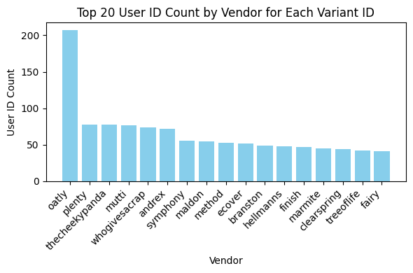
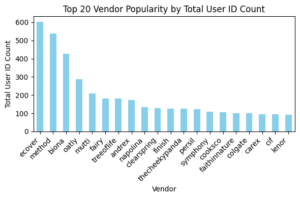
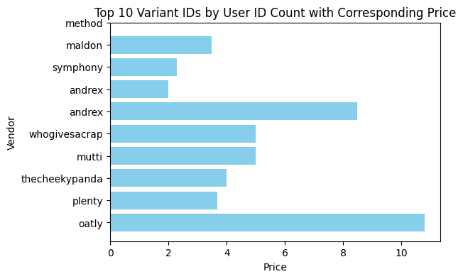
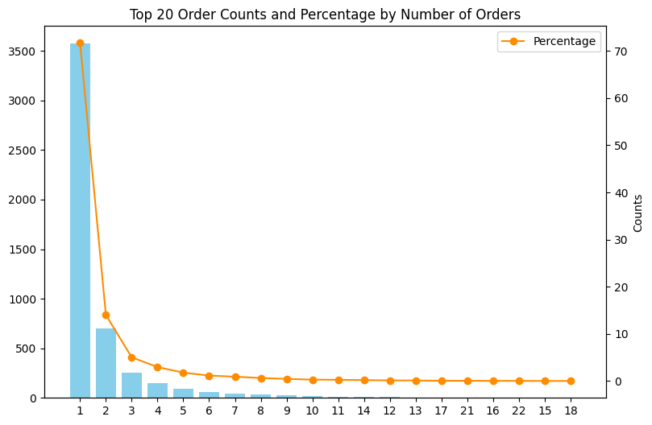
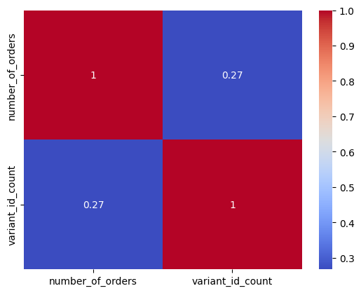
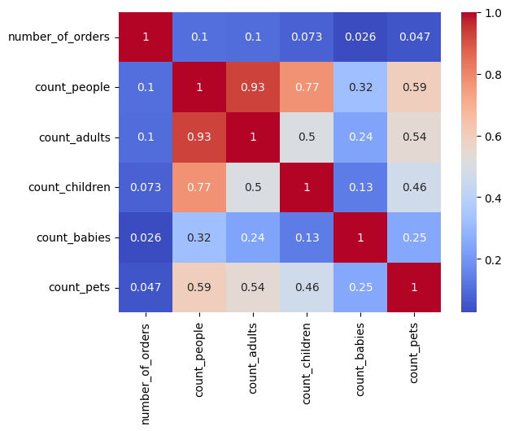

# Homework 2

**Dataset description:**
- orders.parquet: An order history of customers. Each row is an order and the item_ids for the order are stored as a list in the item_ids column
- regulars.parquet: Users are allowed to specify items that they wish to buy regularly. This data gives the items each user has asked to get regularly, along with when they input that information.
- abandoned_cart.parquet: If a user has added items to their basket but not
bought them, we capture that information. Items that were abandoned are stored
as a list in item_ids.
- inventory.parquet: Some information about each item_id
- users.parquet: Information about users.


```python
import pandas as pd
import numpy as np
import matplotlib.pyplot as plt
import seaborn as sns
```


```python
df_orders = pd.read_parquet('/Users/alvaroleal/Desktop/DS/Zrive/orders.parquet')
df_regulars = pd.read_parquet('/Users/alvaroleal/Desktop/DS/Zrive/regulars.parquet')
df_abandoned_carts = pd.read_parquet('/Users/alvaroleal/Desktop/DS/Zrive/abandoned_carts.parquet')
df_inventory = pd.read_parquet('/Users/alvaroleal/Desktop/DS/Zrive/inventory.parquet')
df_users = pd.read_parquet('/Users/alvaroleal/Desktop/DS/Zrive/users.parquet')
df_feature_frame = pd.read_csv('/Users/alvaroleal/Desktop/DS/Zrive/feature_frame.csv')
```

# 1. Understanding the problem space
Para ello, vamos a definir una fun función que rapidamente haga todos los quick checks con cada uno de los datasets.


```python
def quick_view(df):
    print('Primeras filas:')
    print(df.head())
    print('\n')

    print('Información general:')
    df.info()
    print('\n')

    print('Número de valores null:')
    print(df.isnull().sum())
    print('\n')

    print('Porcentaje de valores null:')
    print(df.isnull().mean() * 100)
    print('\n')
```


```python
quick_view(df_orders)
```

    Primeras filas:
                   id                                            user_id  \
    10  2204073066628  62e271062eb827e411bd73941178d29b022f5f2de9d37f...   
    20  2204707520644  bf591c887c46d5d3513142b6a855dd7ffb9cc00697f6f5...   
    21  2204838822020  329f08c66abb51f8c0b8a9526670da2d94c0c6eef06700...   
    34  2208967852164  f6451fce7b1c58d0effbe37fcb4e67b718193562766470...   
    49  2215889436804  68e872ff888303bff58ec56a3a986f77ddebdbe5c279e7...   
    
                created_at order_date  user_order_seq  \
    10 2020-04-30 14:32:19 2020-04-30               1   
    20 2020-04-30 17:39:00 2020-04-30               1   
    21 2020-04-30 18:12:30 2020-04-30               1   
    34 2020-05-01 19:44:11 2020-05-01               1   
    49 2020-05-03 21:56:14 2020-05-03               1   
    
                                            ordered_items  
    10  [33618849693828, 33618860179588, 3361887404045...  
    20  [33618835243140, 33618835964036, 3361886244058...  
    21  [33618891145348, 33618893570180, 3361889766618...  
    34  [33618830196868, 33618846580868, 3361891234624...  
    49  [33667166699652, 33667166699652, 3366717122163...  
    
    
    Información general:
    <class 'pandas.core.frame.DataFrame'>
    Index: 8773 entries, 10 to 64538
    Data columns (total 6 columns):
     #   Column          Non-Null Count  Dtype         
    ---  ------          --------------  -----         
     0   id              8773 non-null   int64         
     1   user_id         8773 non-null   object        
     2   created_at      8773 non-null   datetime64[us]
     3   order_date      8773 non-null   datetime64[us]
     4   user_order_seq  8773 non-null   int64         
     5   ordered_items   8773 non-null   object        
    dtypes: datetime64[us](2), int64(2), object(2)
    memory usage: 479.8+ KB
    
    
    Número de valores null:
    id                0
    user_id           0
    created_at        0
    order_date        0
    user_order_seq    0
    ordered_items     0
    dtype: int64
    
    
    Porcentaje de valores null:
    id                0.0
    user_id           0.0
    created_at        0.0
    order_date        0.0
    user_order_seq    0.0
    ordered_items     0.0
    dtype: float64
    
    


Vemos que no hay valores nulos y que parece que trabjamos con una muestra de un dataset mayor: 8773 entries, 10 to 64538. Todo parece OK aunque no sé bien como hacer el match entre ordered_items y el variant_id de los otros datasets. Se me ocurre hacer otra columna con el espacio temportal entre created_at y order_date para obtener aún mas datos significativos como que productos generan mas dudas al consumidor, compras impulsivas tipos de consumidores, etc...


```python
quick_view(df_regulars)
```

    Primeras filas:
                                                  user_id      variant_id  \
    3   68e872ff888303bff58ec56a3a986f77ddebdbe5c279e7...  33618848088196   
    11  aed88fc0b004270a62ff1fe4b94141f6b1db1496dbb0c0...  33667178659972   
    18  68e872ff888303bff58ec56a3a986f77ddebdbe5c279e7...  33619009208452   
    46  aed88fc0b004270a62ff1fe4b94141f6b1db1496dbb0c0...  33667305373828   
    47  4594e99557113d5a1c5b59bf31b8704aafe5c7bd180b32...  33667247341700   
    
                created_at  
    3  2020-04-30 15:07:03  
    11 2020-05-05 23:34:35  
    18 2020-04-30 15:07:03  
    46 2020-05-05 23:34:35  
    47 2020-05-06 14:42:11  
    
    
    Información general:
    <class 'pandas.core.frame.DataFrame'>
    Index: 18105 entries, 3 to 37720
    Data columns (total 3 columns):
     #   Column      Non-Null Count  Dtype         
    ---  ------      --------------  -----         
     0   user_id     18105 non-null  object        
     1   variant_id  18105 non-null  int64         
     2   created_at  18105 non-null  datetime64[us]
    dtypes: datetime64[us](1), int64(1), object(1)
    memory usage: 565.8+ KB
    
    
    Número de valores null:
    user_id       0
    variant_id    0
    created_at    0
    dtype: int64
    
    
    Porcentaje de valores null:
    user_id       0.0
    variant_id    0.0
    created_at    0.0
    dtype: float64
    
    


Todo parece OK, genial para generar sistemas de recomendaciones.


```python
quick_view(df_abandoned_carts)
```

    Primeras filas:
                    id                                            user_id  \
    0   12858560217220  5c4e5953f13ddc3bc9659a3453356155e5efe4739d7a2b...   
    13  20352449839236  9d6187545c005d39e44d0456d87790db18611d7c7379bd...   
    45  20478401413252  e83fb0273d70c37a2968fee107113698fd4f389c442c0b...   
    50  20481783103620  10c42e10e530284b7c7c50f3a23a98726d5747b8128084...   
    52  20485321687172  d9989439524b3f6fc4f41686d043f315fb408b954d6153...   
    
                created_at                                         variant_id  
    0  2020-05-20 13:53:24  [33826459287684, 33826457616516, 3366719212762...  
    13 2021-06-27 05:24:13  [34415988179076, 34037940158596, 3450282236326...  
    45 2021-07-18 08:23:49  [34543001337988, 34037939372164, 3411360609088...  
    50 2021-07-18 21:29:36  [33667268116612, 34037940224132, 3443605520397...  
    52 2021-07-19 12:17:05   [33667268083844, 34284950454404, 33973246886020]  
    
    
    Información general:
    <class 'pandas.core.frame.DataFrame'>
    Index: 5457 entries, 0 to 70050
    Data columns (total 4 columns):
     #   Column      Non-Null Count  Dtype         
    ---  ------      --------------  -----         
     0   id          5457 non-null   int64         
     1   user_id     5457 non-null   object        
     2   created_at  5457 non-null   datetime64[us]
     3   variant_id  5457 non-null   object        
    dtypes: datetime64[us](1), int64(1), object(2)
    memory usage: 213.2+ KB
    
    
    Número de valores null:
    id            0
    user_id       0
    created_at    0
    variant_id    0
    dtype: int64
    
    
    Porcentaje de valores null:
    id            0.0
    user_id       0.0
    created_at    0.0
    variant_id    0.0
    dtype: float64
    
    


Todo parece OK en primeras.


```python
quick_view(df_inventory)
```

    Primeras filas:
           variant_id  price  compare_at_price          vendor  \
    0  39587297165444   3.09              3.15           heinz   
    1  34370361229444   4.99              5.50   whogivesacrap   
    2  34284951863428   3.69              3.99          plenty   
    3  33667283583108   1.79              1.99  thecheekypanda   
    4  33803537973380   1.99              2.09         colgate   
    
                          product_type                                        tags  
    0             condiments-dressings                       [table-sauces, vegan]  
    1  toilet-roll-kitchen-roll-tissue                 [b-corp, eco, toilet-rolls]  
    2  toilet-roll-kitchen-roll-tissue                              [kitchen-roll]  
    3  toilet-roll-kitchen-roll-tissue  [b-corp, cruelty-free, eco, tissue, vegan]  
    4                           dental                        [dental-accessories]  
    
    
    Información general:
    <class 'pandas.core.frame.DataFrame'>
    RangeIndex: 1733 entries, 0 to 1732
    Data columns (total 6 columns):
     #   Column            Non-Null Count  Dtype  
    ---  ------            --------------  -----  
     0   variant_id        1733 non-null   int64  
     1   price             1733 non-null   float64
     2   compare_at_price  1733 non-null   float64
     3   vendor            1733 non-null   object 
     4   product_type      1733 non-null   object 
     5   tags              1733 non-null   object 
    dtypes: float64(2), int64(1), object(3)
    memory usage: 81.4+ KB
    
    
    Número de valores null:
    variant_id          0
    price               0
    compare_at_price    0
    vendor              0
    product_type        0
    tags                0
    dtype: int64
    
    
    Porcentaje de valores null:
    variant_id          0.0
    price               0.0
    compare_at_price    0.0
    vendor              0.0
    product_type        0.0
    tags                0.0
    dtype: float64
    
    


No entiendo bien que puede significar 'compare_at_price', quizás el margen que le sacan al producto.


```python
quick_view(df_users)
```

    Primeras filas:
                                                    user_id user_segment  \
    2160  0e823a42e107461379e5b5613b7aa00537a72e1b0eaa7a...       Top Up   
    1123  15768ced9bed648f745a7aa566a8895f7a73b9a47c1d4f...       Top Up   
    1958  33e0cb6eacea0775e34adbaa2c1dec16b9d6484e6b9324...       Top Up   
    675   57ca7591dc79825df0cecc4836a58e6062454555c86c35...       Top Up   
    4694  085d8e598139ce6fc9f75d9de97960fa9e1457b409ec00...       Top Up   
    
         user_nuts1     first_ordered_at customer_cohort_month  count_people  \
    2160        UKH  2021-05-08 13:33:49   2021-05-01 00:00:00           NaN   
    1123        UKJ  2021-11-17 16:30:20   2021-11-01 00:00:00           NaN   
    1958        UKD  2022-03-09 23:12:25   2022-03-01 00:00:00           NaN   
    675         UKI  2021-04-23 16:29:02   2021-04-01 00:00:00           NaN   
    4694        UKJ  2021-11-02 13:50:06   2021-11-01 00:00:00           NaN   
    
          count_adults  count_children  count_babies  count_pets  
    2160           NaN             NaN           NaN         NaN  
    1123           NaN             NaN           NaN         NaN  
    1958           NaN             NaN           NaN         NaN  
    675            NaN             NaN           NaN         NaN  
    4694           NaN             NaN           NaN         NaN  
    
    
    Información general:
    <class 'pandas.core.frame.DataFrame'>
    Index: 4983 entries, 2160 to 3360
    Data columns (total 10 columns):
     #   Column                 Non-Null Count  Dtype  
    ---  ------                 --------------  -----  
     0   user_id                4983 non-null   object 
     1   user_segment           4983 non-null   object 
     2   user_nuts1             4932 non-null   object 
     3   first_ordered_at       4983 non-null   object 
     4   customer_cohort_month  4983 non-null   object 
     5   count_people           325 non-null    float64
     6   count_adults           325 non-null    float64
     7   count_children         325 non-null    float64
     8   count_babies           325 non-null    float64
     9   count_pets             325 non-null    float64
    dtypes: float64(5), object(5)
    memory usage: 428.2+ KB
    
    
    Número de valores null:
    user_id                     0
    user_segment                0
    user_nuts1                 51
    first_ordered_at            0
    customer_cohort_month       0
    count_people             4658
    count_adults             4658
    count_children           4658
    count_babies             4658
    count_pets               4658
    dtype: int64
    
    
    Porcentaje de valores null:
    user_id                   0.000000
    user_segment              0.000000
    user_nuts1                1.023480
    first_ordered_at          0.000000
    customer_cohort_month     0.000000
    count_people             93.477825
    count_adults             93.477825
    count_children           93.477825
    count_babies             93.477825
    count_pets               93.477825
    dtype: float64
    
    


```python
df_users.groupby('user_segment').count()
```


<div>
<style scoped>
    .dataframe tbody tr th:only-of-type {
        vertical-align: middle;
    }

    .dataframe tbody tr th {
        vertical-align: top;
    }

    .dataframe thead th {
        text-align: right;
    }
</style>
<table border="1" class="dataframe">
  <thead>
    <tr style="text-align: right;">
      <th></th>
      <th>user_id</th>
      <th>user_nuts1</th>
      <th>first_ordered_at</th>
      <th>customer_cohort_month</th>
      <th>count_people</th>
      <th>count_adults</th>
      <th>count_children</th>
      <th>count_babies</th>
      <th>count_pets</th>
    </tr>
    <tr>
      <th>user_segment</th>
      <th></th>
      <th></th>
      <th></th>
      <th></th>
      <th></th>
      <th></th>
      <th></th>
      <th></th>
      <th></th>
    </tr>
  </thead>
  <tbody>
    <tr>
      <th>Proposition</th>
      <td>2340</td>
      <td>2315</td>
      <td>2340</td>
      <td>2340</td>
      <td>193</td>
      <td>193</td>
      <td>193</td>
      <td>193</td>
      <td>193</td>
    </tr>
    <tr>
      <th>Top Up</th>
      <td>2643</td>
      <td>2617</td>
      <td>2643</td>
      <td>2643</td>
      <td>132</td>
      <td>132</td>
      <td>132</td>
      <td>132</td>
      <td>132</td>
    </tr>
  </tbody>
</table>
</div>


Más del 93% de los datos en 5 categorias son Null, parece que se dejaron de pedir por algun motivo (quizas temas de privacidad) o que se han pedido de manera opcional y pocos usuarios los proporcionan.

# First Analysis conducted - Popularidad de producto
En este análsis vamos a ver que productos son los más populares en función a las veces que estos son añadidos como 'wise to buy regularly'.


```python
df_variant_user_counts = df_regulars.groupby('variant_id')['user_id'].nunique().reset_index()
df_variant_user_counts.rename(columns={'user_id': 'user_id_count'}, inplace=True)
df_inventory_merged = pd.merge(df_inventory, df_variant_user_counts, how='left', on='variant_id')
```


```python
print(df_inventory_merged.isnull().sum())
```

    variant_id            0
    price                 0
    compare_at_price      0
    vendor                0
    product_type          0
    tags                  0
    user_id_count       448
    dtype: int64


Parece que hay una serie de varianted el dataframe de inventory las cuales no estaban en el dataframe de regulars. Vamos a comprobarlo rapidamente para ver que estamos haciendo todo bien:


```python
print(f'Valores únicos de inventory: {len(df_inventory['variant_id'].unique())}')
print(f'Valores únicos de regulars: {len(df_regulars['variant_id'].unique())}')
```

    Valores únicos de inventory: 1733
    Valores únicos de regulars: 1843


```python
unicos_inventory = df_inventory['variant_id'].unique()
unicos_regulars = df_regulars['variant_id'].unique()
valores_coincidentes = np.intersect1d(unicos_inventory, unicos_regulars)

print(f'Valores únicos coincidentes entre inventory y regulars: {len(unicos_inventory) - len(valores_coincidentes)}')
```

    Valores únicos coincidentes entre inventory y regulars: 448


**Estudio de la popularidad por marca:**


```python
df_inventory_merged['user_id_count'] = df_inventory_merged['user_id_count'].fillna(0).astype(int)

df_inventory_merged_sorted = df_inventory_merged.sort_values(by='user_id_count', ascending=False)

plt.figure(figsize=(6, 4))
plt.bar(df_inventory_merged_sorted['vendor'].head(20), df_inventory_merged_sorted['user_id_count'].head(20), color='skyblue')
plt.xlabel('Vendor')
plt.ylabel('User ID Count')
plt.title('Top 20 User ID Count by Vendor for Each Variant ID')
plt.xticks(rotation=45, ha='right')
plt.tight_layout()

plt.show()
```


    

    


```python
df_vendor_popularity = df_inventory_merged_sorted.groupby('vendor')['user_id_count'].sum().sort_values(ascending=False)
plt.figure(figsize=(6, 4))
df_vendor_popularity.head(20).plot(kind='bar', color='skyblue')
plt.xlabel('Vendor')
plt.ylabel('Total User ID Count')
plt.title('Top 20 Vendor Popularity by Total User ID Count')
plt.xticks(rotation=45, ha='right')
plt.tight_layout()

plt.show()
```


    

    


**Estudio de la popularidad por precio:**


```python

plt.figure(figsize=(6, 4))
plt.barh(df_inventory_merged_sorted['vendor'].head(10), df_inventory_merged_sorted['price'].head(10), color='skyblue')
plt.xlabel('Price')
plt.ylabel('Vendor')
plt.title('Top 10 Variant IDs by User ID Count with Corresponding Price')

plt.yticks(ticks=range(len(df_inventory_merged_sorted['vendor'].head(10))), labels=df_inventory_merged_sorted['vendor'].head(10))

plt.show()
```


    

    


# Second Analysis conducted - Usuarios de más valor

**Estudio de la frecuencia de pedidos por usuario:**


```python
df_user_id_counts = df_orders.groupby('user_id')['id'].nunique().reset_index()
df_user_id_counts.rename(columns={'id': 'number_of_orders'}, inplace=True)
df_users_merged = pd.merge(df_users, df_user_id_counts, how='left', on='user_id')

df_users_merged['number_of_orders'] = df_users_merged['number_of_orders'].fillna(0).astype(int)

df_users_merged.head()
```


<div>
<style scoped>
    .dataframe tbody tr th:only-of-type {
        vertical-align: middle;
    }

    .dataframe tbody tr th {
        vertical-align: top;
    }

    .dataframe thead th {
        text-align: right;
    }
</style>
<table border="1" class="dataframe">
  <thead>
    <tr style="text-align: right;">
      <th></th>
      <th>user_id</th>
      <th>user_segment</th>
      <th>user_nuts1</th>
      <th>first_ordered_at</th>
      <th>customer_cohort_month</th>
      <th>count_people</th>
      <th>count_adults</th>
      <th>count_children</th>
      <th>count_babies</th>
      <th>count_pets</th>
      <th>number_of_orders</th>
    </tr>
  </thead>
  <tbody>
    <tr>
      <th>0</th>
      <td>0e823a42e107461379e5b5613b7aa00537a72e1b0eaa7a...</td>
      <td>Top Up</td>
      <td>UKH</td>
      <td>2021-05-08 13:33:49</td>
      <td>2021-05-01 00:00:00</td>
      <td>NaN</td>
      <td>NaN</td>
      <td>NaN</td>
      <td>NaN</td>
      <td>NaN</td>
      <td>1</td>
    </tr>
    <tr>
      <th>1</th>
      <td>15768ced9bed648f745a7aa566a8895f7a73b9a47c1d4f...</td>
      <td>Top Up</td>
      <td>UKJ</td>
      <td>2021-11-17 16:30:20</td>
      <td>2021-11-01 00:00:00</td>
      <td>NaN</td>
      <td>NaN</td>
      <td>NaN</td>
      <td>NaN</td>
      <td>NaN</td>
      <td>1</td>
    </tr>
    <tr>
      <th>2</th>
      <td>33e0cb6eacea0775e34adbaa2c1dec16b9d6484e6b9324...</td>
      <td>Top Up</td>
      <td>UKD</td>
      <td>2022-03-09 23:12:25</td>
      <td>2022-03-01 00:00:00</td>
      <td>NaN</td>
      <td>NaN</td>
      <td>NaN</td>
      <td>NaN</td>
      <td>NaN</td>
      <td>1</td>
    </tr>
    <tr>
      <th>3</th>
      <td>57ca7591dc79825df0cecc4836a58e6062454555c86c35...</td>
      <td>Top Up</td>
      <td>UKI</td>
      <td>2021-04-23 16:29:02</td>
      <td>2021-04-01 00:00:00</td>
      <td>NaN</td>
      <td>NaN</td>
      <td>NaN</td>
      <td>NaN</td>
      <td>NaN</td>
      <td>10</td>
    </tr>
    <tr>
      <th>4</th>
      <td>085d8e598139ce6fc9f75d9de97960fa9e1457b409ec00...</td>
      <td>Top Up</td>
      <td>UKJ</td>
      <td>2021-11-02 13:50:06</td>
      <td>2021-11-01 00:00:00</td>
      <td>NaN</td>
      <td>NaN</td>
      <td>NaN</td>
      <td>NaN</td>
      <td>NaN</td>
      <td>1</td>
    </tr>
  </tbody>
</table>
</div>


```python
print(df_users_merged['user_segment'].unique())
```

    ['Top Up' 'Proposition']


```python
df_users_merged.groupby('user_segment').count()
```


<div>
<style scoped>
    .dataframe tbody tr th:only-of-type {
        vertical-align: middle;
    }

    .dataframe tbody tr th {
        vertical-align: top;
    }

    .dataframe thead th {
        text-align: right;
    }
</style>
<table border="1" class="dataframe">
  <thead>
    <tr style="text-align: right;">
      <th></th>
      <th>user_id</th>
      <th>user_nuts1</th>
      <th>first_ordered_at</th>
      <th>customer_cohort_month</th>
      <th>count_people</th>
      <th>count_adults</th>
      <th>count_children</th>
      <th>count_babies</th>
      <th>count_pets</th>
      <th>number_of_orders</th>
    </tr>
    <tr>
      <th>user_segment</th>
      <th></th>
      <th></th>
      <th></th>
      <th></th>
      <th></th>
      <th></th>
      <th></th>
      <th></th>
      <th></th>
      <th></th>
    </tr>
  </thead>
  <tbody>
    <tr>
      <th>Proposition</th>
      <td>2340</td>
      <td>2315</td>
      <td>2340</td>
      <td>2340</td>
      <td>193</td>
      <td>193</td>
      <td>193</td>
      <td>193</td>
      <td>193</td>
      <td>2340</td>
    </tr>
    <tr>
      <th>Top Up</th>
      <td>2643</td>
      <td>2617</td>
      <td>2643</td>
      <td>2643</td>
      <td>132</td>
      <td>132</td>
      <td>132</td>
      <td>132</td>
      <td>132</td>
      <td>2643</td>
    </tr>
  </tbody>
</table>
</div>


```python
df_users_merged_counts = df_users_merged.groupby('number_of_orders').size().reset_index(name='counts')
df_users_merged_counts['percentage'] = (df_users_merged_counts['counts'] / df_users_merged_counts['counts'].sum()) * 100
df_users_merged_counts
```


<div>
<style scoped>
    .dataframe tbody tr th:only-of-type {
        vertical-align: middle;
    }

    .dataframe tbody tr th {
        vertical-align: top;
    }

    .dataframe thead th {
        text-align: right;
    }
</style>
<table border="1" class="dataframe">
  <thead>
    <tr style="text-align: right;">
      <th></th>
      <th>number_of_orders</th>
      <th>counts</th>
      <th>percentage</th>
    </tr>
  </thead>
  <tbody>
    <tr>
      <th>0</th>
      <td>1</td>
      <td>3572</td>
      <td>71.683725</td>
    </tr>
    <tr>
      <th>1</th>
      <td>2</td>
      <td>698</td>
      <td>14.007626</td>
    </tr>
    <tr>
      <th>2</th>
      <td>3</td>
      <td>251</td>
      <td>5.037126</td>
    </tr>
    <tr>
      <th>3</th>
      <td>4</td>
      <td>148</td>
      <td>2.970098</td>
    </tr>
    <tr>
      <th>4</th>
      <td>5</td>
      <td>89</td>
      <td>1.786073</td>
    </tr>
    <tr>
      <th>5</th>
      <td>6</td>
      <td>58</td>
      <td>1.163957</td>
    </tr>
    <tr>
      <th>6</th>
      <td>7</td>
      <td>46</td>
      <td>0.923139</td>
    </tr>
    <tr>
      <th>7</th>
      <td>8</td>
      <td>32</td>
      <td>0.642183</td>
    </tr>
    <tr>
      <th>8</th>
      <td>9</td>
      <td>23</td>
      <td>0.461569</td>
    </tr>
    <tr>
      <th>9</th>
      <td>10</td>
      <td>15</td>
      <td>0.301023</td>
    </tr>
    <tr>
      <th>10</th>
      <td>11</td>
      <td>13</td>
      <td>0.260887</td>
    </tr>
    <tr>
      <th>11</th>
      <td>12</td>
      <td>7</td>
      <td>0.140478</td>
    </tr>
    <tr>
      <th>12</th>
      <td>13</td>
      <td>6</td>
      <td>0.120409</td>
    </tr>
    <tr>
      <th>13</th>
      <td>14</td>
      <td>10</td>
      <td>0.200682</td>
    </tr>
    <tr>
      <th>14</th>
      <td>15</td>
      <td>1</td>
      <td>0.020068</td>
    </tr>
    <tr>
      <th>15</th>
      <td>16</td>
      <td>2</td>
      <td>0.040136</td>
    </tr>
    <tr>
      <th>16</th>
      <td>17</td>
      <td>3</td>
      <td>0.060205</td>
    </tr>
    <tr>
      <th>17</th>
      <td>18</td>
      <td>1</td>
      <td>0.020068</td>
    </tr>
    <tr>
      <th>18</th>
      <td>19</td>
      <td>1</td>
      <td>0.020068</td>
    </tr>
    <tr>
      <th>19</th>
      <td>20</td>
      <td>1</td>
      <td>0.020068</td>
    </tr>
    <tr>
      <th>20</th>
      <td>21</td>
      <td>3</td>
      <td>0.060205</td>
    </tr>
    <tr>
      <th>21</th>
      <td>22</td>
      <td>2</td>
      <td>0.040136</td>
    </tr>
    <tr>
      <th>22</th>
      <td>25</td>
      <td>1</td>
      <td>0.020068</td>
    </tr>
  </tbody>
</table>
</div>


```python
top20_df_users_merged_counts = df_users_merged_counts.sort_values(by='counts', ascending=False).head(20)

plt.figure(figsize=(9, 6))
plt.bar(top20_df_users_merged_counts['number_of_orders'].astype(str), top20_df_users_merged_counts['counts'], color='skyblue', label='Counts')

ax2 = plt.gca().twinx()
ax2.plot(top20_df_users_merged_counts['number_of_orders'].astype(str), top20_df_users_merged_counts['percentage'], color='darkorange', label='Percentage', marker='o', linestyle='-')
ax2.set_ylabel('Percentage (%)')

plt.legend(loc='upper left')
ax2.legend(loc='upper right')

plt.title('Top 20 Order Counts and Percentage by Number of Orders')
plt.xlabel('Number of Orders')
plt.ylabel('Counts')

plt.show()
```


    

    


**Ahora vamos a añadir el número de veces que un usuario ha añadido un producto a favoritos**


```python
df_user_variant_counts = df_regulars.groupby('user_id')['variant_id'].nunique().reset_index()
df_user_variant_counts.rename(columns={'variant_id': 'variant_id_count'}, inplace=True)
df_users_merged2 = pd.merge(df_users_merged, df_user_variant_counts, how='left', on='user_id')

df_users_merged2['variant_id_count'] = df_users_merged2['variant_id_count'].fillna(0).astype(int)
df_users_merged2 = df_users_merged2.sort_values(by='variant_id_count', ascending=False)

df_users_merged2.head()
```


<div>
<style scoped>
    .dataframe tbody tr th:only-of-type {
        vertical-align: middle;
    }

    .dataframe tbody tr th {
        vertical-align: top;
    }

    .dataframe thead th {
        text-align: right;
    }
</style>
<table border="1" class="dataframe">
  <thead>
    <tr style="text-align: right;">
      <th></th>
      <th>user_id</th>
      <th>user_segment</th>
      <th>user_nuts1</th>
      <th>first_ordered_at</th>
      <th>customer_cohort_month</th>
      <th>count_people</th>
      <th>count_adults</th>
      <th>count_children</th>
      <th>count_babies</th>
      <th>count_pets</th>
      <th>number_of_orders</th>
      <th>variant_id_count</th>
    </tr>
  </thead>
  <tbody>
    <tr>
      <th>4033</th>
      <td>9a4b53affbe91ca5fd0c97f6d86e8a59ae894f3c7a69a8...</td>
      <td>Proposition</td>
      <td>UKI</td>
      <td>2021-11-16 09:46:26</td>
      <td>2021-11-01 00:00:00</td>
      <td>NaN</td>
      <td>NaN</td>
      <td>NaN</td>
      <td>NaN</td>
      <td>NaN</td>
      <td>1</td>
      <td>320</td>
    </tr>
    <tr>
      <th>3796</th>
      <td>9b5b3679033da9e1f3a4def18667e40a7763d0d3ec9d8f...</td>
      <td>Proposition</td>
      <td>UKK</td>
      <td>2022-01-19 21:40:39</td>
      <td>2022-01-01 00:00:00</td>
      <td>NaN</td>
      <td>NaN</td>
      <td>NaN</td>
      <td>NaN</td>
      <td>NaN</td>
      <td>3</td>
      <td>110</td>
    </tr>
    <tr>
      <th>3708</th>
      <td>11c967ad95d1e3a8f9767612e2f084aad75832cf019f8a...</td>
      <td>Proposition</td>
      <td>UKD</td>
      <td>2021-01-06 08:52:51</td>
      <td>2021-01-01 00:00:00</td>
      <td>NaN</td>
      <td>NaN</td>
      <td>NaN</td>
      <td>NaN</td>
      <td>NaN</td>
      <td>5</td>
      <td>90</td>
    </tr>
    <tr>
      <th>2098</th>
      <td>af86901cbe9be971840f20e73e8af9d733f0887163f331...</td>
      <td>Proposition</td>
      <td>None</td>
      <td>2021-03-10 10:09:10</td>
      <td>2021-03-01 00:00:00</td>
      <td>NaN</td>
      <td>NaN</td>
      <td>NaN</td>
      <td>NaN</td>
      <td>NaN</td>
      <td>3</td>
      <td>88</td>
    </tr>
    <tr>
      <th>3140</th>
      <td>27c2c38327ba83867c6291ee6bd0c35548edd256ed51c9...</td>
      <td>Proposition</td>
      <td>UKL</td>
      <td>2020-07-13 20:25:43</td>
      <td>2020-07-01 00:00:00</td>
      <td>2.0</td>
      <td>2.0</td>
      <td>0.0</td>
      <td>0.0</td>
      <td>0.0</td>
      <td>9</td>
      <td>85</td>
    </tr>
  </tbody>
</table>
</div>


```python
sns.heatmap(df_users_merged2[['number_of_orders', 'variant_id_count']].corr(), annot=True, cmap='coolwarm')
plt.show()
```


    

    


Hay una relación positiva entre estas dos variables, pero esta asociación no es lo suficientemente fuerte como para considerarla significativa.

**Estudio de la correlacion entre count_people, count_adults, count_children, count_babies, count_pets y el número de pedidos**


```python
column_names = ['count_people', 'count_adults', 'count_children', 'count_babies', 'count_pets']

for column in column_names:
    df_users_merged2[column] = df_users_merged2[column].fillna(0).astype(int)

sns.heatmap(df_users_merged2[['number_of_orders', 'count_people', 'count_adults', 'count_children', 'count_babies', 'count_pets']].corr(), annot=True, cmap='coolwarm')
plt.show()
```


    

    


# Third - Creamos un dataset

Aunque se que vamos a perder algo de información al perder la trazabilidad de los productos que se han comprado juntos (lo cual creo que luego podemos añadir), para hacer un dataframe se me ocurre hacer un merge de los anteriores dos df que hemos usaod sobre variant_id y user_id con df_orders.


```python
df_orders_expanded.dtypes
```


    id                         int64
    user_id                   object
    created_at        datetime64[us]
    order_date        datetime64[us]
    user_order_seq             int64
    ordered_items             object
    dtype: object


```python
df_orders_expanded = df_orders.explode('ordered_items')
df_orders_expanded.rename(columns={'ordered_items': 'variant_id'}, inplace=True)
df_orders_expanded = pd.merge(df_orders_expanded, df_inventory_merged, how='left', on='variant_id')
df_orders_expanded = pd.merge(df_orders_expanded, df_users_merged2, how='left', on='user_id')

df_orders_expanded
```


<div>
<style scoped>
    .dataframe tbody tr th:only-of-type {
        vertical-align: middle;
    }

    .dataframe tbody tr th {
        vertical-align: top;
    }

    .dataframe thead th {
        text-align: right;
    }
</style>
<table border="1" class="dataframe">
  <thead>
    <tr style="text-align: right;">
      <th></th>
      <th>id</th>
      <th>user_id</th>
      <th>created_at</th>
      <th>order_date</th>
      <th>user_order_seq</th>
      <th>variant_id</th>
      <th>price</th>
      <th>compare_at_price</th>
      <th>vendor</th>
      <th>product_type</th>
      <th>...</th>
      <th>user_nuts1</th>
      <th>first_ordered_at</th>
      <th>customer_cohort_month</th>
      <th>count_people</th>
      <th>count_adults</th>
      <th>count_children</th>
      <th>count_babies</th>
      <th>count_pets</th>
      <th>number_of_orders</th>
      <th>variant_id_count</th>
    </tr>
  </thead>
  <tbody>
    <tr>
      <th>0</th>
      <td>2204073066628</td>
      <td>62e271062eb827e411bd73941178d29b022f5f2de9d37f...</td>
      <td>2020-04-30 14:32:19</td>
      <td>2020-04-30</td>
      <td>1</td>
      <td>33618849693828</td>
      <td>NaN</td>
      <td>NaN</td>
      <td>NaN</td>
      <td>NaN</td>
      <td>...</td>
      <td>UKI</td>
      <td>2020-04-30 14:32:19</td>
      <td>2020-04-01 00:00:00</td>
      <td>4</td>
      <td>4</td>
      <td>0</td>
      <td>0</td>
      <td>0</td>
      <td>2</td>
      <td>18</td>
    </tr>
    <tr>
      <th>1</th>
      <td>2204073066628</td>
      <td>62e271062eb827e411bd73941178d29b022f5f2de9d37f...</td>
      <td>2020-04-30 14:32:19</td>
      <td>2020-04-30</td>
      <td>1</td>
      <td>33618860179588</td>
      <td>NaN</td>
      <td>NaN</td>
      <td>NaN</td>
      <td>NaN</td>
      <td>...</td>
      <td>UKI</td>
      <td>2020-04-30 14:32:19</td>
      <td>2020-04-01 00:00:00</td>
      <td>4</td>
      <td>4</td>
      <td>0</td>
      <td>0</td>
      <td>0</td>
      <td>2</td>
      <td>18</td>
    </tr>
    <tr>
      <th>2</th>
      <td>2204073066628</td>
      <td>62e271062eb827e411bd73941178d29b022f5f2de9d37f...</td>
      <td>2020-04-30 14:32:19</td>
      <td>2020-04-30</td>
      <td>1</td>
      <td>33618874040452</td>
      <td>NaN</td>
      <td>NaN</td>
      <td>NaN</td>
      <td>NaN</td>
      <td>...</td>
      <td>UKI</td>
      <td>2020-04-30 14:32:19</td>
      <td>2020-04-01 00:00:00</td>
      <td>4</td>
      <td>4</td>
      <td>0</td>
      <td>0</td>
      <td>0</td>
      <td>2</td>
      <td>18</td>
    </tr>
    <tr>
      <th>3</th>
      <td>2204073066628</td>
      <td>62e271062eb827e411bd73941178d29b022f5f2de9d37f...</td>
      <td>2020-04-30 14:32:19</td>
      <td>2020-04-30</td>
      <td>1</td>
      <td>33618907005060</td>
      <td>NaN</td>
      <td>NaN</td>
      <td>NaN</td>
      <td>NaN</td>
      <td>...</td>
      <td>UKI</td>
      <td>2020-04-30 14:32:19</td>
      <td>2020-04-01 00:00:00</td>
      <td>4</td>
      <td>4</td>
      <td>0</td>
      <td>0</td>
      <td>0</td>
      <td>2</td>
      <td>18</td>
    </tr>
    <tr>
      <th>4</th>
      <td>2204073066628</td>
      <td>62e271062eb827e411bd73941178d29b022f5f2de9d37f...</td>
      <td>2020-04-30 14:32:19</td>
      <td>2020-04-30</td>
      <td>1</td>
      <td>33618907005060</td>
      <td>NaN</td>
      <td>NaN</td>
      <td>NaN</td>
      <td>NaN</td>
      <td>...</td>
      <td>UKI</td>
      <td>2020-04-30 14:32:19</td>
      <td>2020-04-01 00:00:00</td>
      <td>4</td>
      <td>4</td>
      <td>0</td>
      <td>0</td>
      <td>0</td>
      <td>2</td>
      <td>18</td>
    </tr>
    <tr>
      <th>...</th>
      <td>...</td>
      <td>...</td>
      <td>...</td>
      <td>...</td>
      <td>...</td>
      <td>...</td>
      <td>...</td>
      <td>...</td>
      <td>...</td>
      <td>...</td>
      <td>...</td>
      <td>...</td>
      <td>...</td>
      <td>...</td>
      <td>...</td>
      <td>...</td>
      <td>...</td>
      <td>...</td>
      <td>...</td>
      <td>...</td>
      <td>...</td>
    </tr>
    <tr>
      <th>107953</th>
      <td>4026732413060</td>
      <td>faaad4bc113fe7e0a888a0d3535877d3c692f591882c25...</td>
      <td>2022-03-14 00:24:59</td>
      <td>2022-03-14</td>
      <td>3</td>
      <td>34537169453188</td>
      <td>0.99</td>
      <td>1.38</td>
      <td>whiskas</td>
      <td>cat-food</td>
      <td>...</td>
      <td>UKD</td>
      <td>2022-01-02 00:39:26</td>
      <td>2022-01-01 00:00:00</td>
      <td>0</td>
      <td>0</td>
      <td>0</td>
      <td>0</td>
      <td>0</td>
      <td>3</td>
      <td>1</td>
    </tr>
    <tr>
      <th>107954</th>
      <td>4026732413060</td>
      <td>faaad4bc113fe7e0a888a0d3535877d3c692f591882c25...</td>
      <td>2022-03-14 00:24:59</td>
      <td>2022-03-14</td>
      <td>3</td>
      <td>39368665432196</td>
      <td>4.99</td>
      <td>5.09</td>
      <td>whiskas</td>
      <td>cat-food</td>
      <td>...</td>
      <td>UKD</td>
      <td>2022-01-02 00:39:26</td>
      <td>2022-01-01 00:00:00</td>
      <td>0</td>
      <td>0</td>
      <td>0</td>
      <td>0</td>
      <td>0</td>
      <td>3</td>
      <td>1</td>
    </tr>
    <tr>
      <th>107955</th>
      <td>4026732413060</td>
      <td>faaad4bc113fe7e0a888a0d3535877d3c692f591882c25...</td>
      <td>2022-03-14 00:24:59</td>
      <td>2022-03-14</td>
      <td>3</td>
      <td>39403033428100</td>
      <td>3.29</td>
      <td>3.40</td>
      <td>napolina</td>
      <td>tins-packaged-foods</td>
      <td>...</td>
      <td>UKD</td>
      <td>2022-01-02 00:39:26</td>
      <td>2022-01-01 00:00:00</td>
      <td>0</td>
      <td>0</td>
      <td>0</td>
      <td>0</td>
      <td>0</td>
      <td>3</td>
      <td>1</td>
    </tr>
    <tr>
      <th>107956</th>
      <td>4026732413060</td>
      <td>faaad4bc113fe7e0a888a0d3535877d3c692f591882c25...</td>
      <td>2022-03-14 00:24:59</td>
      <td>2022-03-14</td>
      <td>3</td>
      <td>39459281272964</td>
      <td>4.49</td>
      <td>9.00</td>
      <td>cif</td>
      <td>cleaning-products</td>
      <td>...</td>
      <td>UKD</td>
      <td>2022-01-02 00:39:26</td>
      <td>2022-01-01 00:00:00</td>
      <td>0</td>
      <td>0</td>
      <td>0</td>
      <td>0</td>
      <td>0</td>
      <td>3</td>
      <td>1</td>
    </tr>
    <tr>
      <th>107957</th>
      <td>4026732413060</td>
      <td>faaad4bc113fe7e0a888a0d3535877d3c692f591882c25...</td>
      <td>2022-03-14 00:24:59</td>
      <td>2022-03-14</td>
      <td>3</td>
      <td>39830155034756</td>
      <td>4.49</td>
      <td>9.00</td>
      <td>cif</td>
      <td>cleaning-products</td>
      <td>...</td>
      <td>UKD</td>
      <td>2022-01-02 00:39:26</td>
      <td>2022-01-01 00:00:00</td>
      <td>0</td>
      <td>0</td>
      <td>0</td>
      <td>0</td>
      <td>0</td>
      <td>3</td>
      <td>1</td>
    </tr>
  </tbody>
</table>
<p>107958 rows × 23 columns</p>
</div>


```python
print(df_orders_expanded.isna().sum())
df_orders_expanded = df_orders_expanded.dropna(subset=['price'])
```

    id                           0
    user_id                      0
    created_at                   0
    order_date                   0
    user_order_seq               0
    variant_id                   0
    price                    15597
    compare_at_price         15597
    vendor                   15597
    product_type             15597
    tags                     15597
    user_id_count            15597
    user_segment                 0
    user_nuts1                 810
    first_ordered_at             0
    customer_cohort_month        0
    count_people                 0
    count_adults                 0
    count_children               0
    count_babies                 0
    count_pets                   0
    number_of_orders             0
    variant_id_count             0
    dtype: int64


```python
def deep_view(df):
    for columna in df.columns:
        print(f"Análisis de la columna: {columna}")

        if pd.api.types.is_numeric_dtype(df[columna]):
            print("Tipo: Numérica")
            print(f"Media: {df[columna].mean()}")
        else:
            print("Tipo: Categórica/Texto")

        print(f"Número total de valores: {df[columna].size}")
        print(f"Número de valores nulos: {df[columna].isnull().sum()}")

        valores_unicos = df[columna].value_counts()
        print(f"Número de valores únicos: {len(valores_unicos)}")
        print("Frecuencias de los valores únicos:")
        print(valores_unicos)

        print("\n" + "-"*50 + "\n")

deep_view(df_orders_expanded)
```

    Análisis de la columna: id
    Tipo: Numérica
    Media: 3701250306294.462
    Número total de valores: 92361
    Número de valores nulos: 0
    Número de valores únicos: 8726
    Frecuencias de los valores únicos:
    id
    3947934548100    113
    3752334098564     62
    3822639513732     59
    3730902712452     56
    4022169960580     54
                    ... 
    3645791895684      1
    2897880449156      1
    2899065110660      1
    2899294486660      1
    2892580257924      1
    Name: count, Length: 8726, dtype: int64
    
    --------------------------------------------------
    
    Análisis de la columna: user_id
    Tipo: Categórica/Texto
    Número total de valores: 92361
    Número de valores nulos: 0
    Número de valores únicos: 4948
    Frecuencias de los valores únicos:
    user_id
    a655b992a3ee5f6aa9f5ab5662c4befac1fdc45c99885b173618b661ca7381c383b1364e977c9f51366cdc62e4d92ff383e8e5aac7ea9a552059be2671de24e2    448
    751784f6b91585570748d781931f56e3ca71fc92bca0346adf0b3deb1581600d647a44aa0d19b3e7cb09ee372fee8d133f5280c12474efa77c52719ed1d06b68    383
    b9452236b95ed2b60d18404a1e8b5aa4652bc3c4518a6ebd205e82478f657f0b874d90b98710d6cea7eb3c3d8ac7309687e12a34ec2a4f26cc7015df6c09d0a5    337
    425c2b5dc3f35d7e690d26b2028201385d622599043c4daa2997191078c9e420645d194f3028d0b63b0428b7063aa2d7f2c70b571226a1ceb70889d892cb85a1    337
    1296e1e72f7f43ff28d7d285f880ad4d213fa8139233c78ad2673af4cc0c1c297180254da494cc3b934858347822be437eeb072acb1403e9476dc0b2f6a83cbe    326
                                                                                                                                       ... 
    2d48296da4d634c9e737e490c2d9ec224b3f8b97829ebfc6bfe0e9e0f9bf0ffee696f93fba414904e5802b4165a8e1ec13871c8447f140e52f7edadb7eddec59      1
    50da96d10b9ba4ec925aa46203ad0ccb9c94e658df15c014b337a08df94c4a6e1528341b3b8d5a035279878a8072351259a0f5c944d4d90334ded90cd273bc9c      1
    da6063e266593b8bce2328426871c9902482831c4855830ad92e7f19d16e3fafdce027e78d67c641a44923be530748899216204e8081ceaec062eef39ff729f7      1
    7e38dbd546bfa71569e630224137b4aa6e03392cd076ff8db29ffb3ece490e6d31cf1fd671677434c2194dcaea4d87ce24c4dc851efff7261cd3f5d5a24a7a21      1
    2b8966669a008cdb2951450604d91e37b27ab5be257a6559f1d272de79d6fd2169369ef367eb74c6806acbf2a7201f480b68fb8ebc2378caa5fd9722d120e35a      1
    Name: count, Length: 4948, dtype: int64
    
    --------------------------------------------------
    
    Análisis de la columna: created_at
    Tipo: Categórica/Texto
    Número total de valores: 92361
    Número de valores nulos: 0
    Número de valores únicos: 8725
    Frecuencias de los valores únicos:
    created_at
    2022-01-06 19:33:36    113
    2021-07-03 14:27:13     62
    2021-09-18 11:57:55     59
    2021-06-07 19:32:09     56
    2021-05-13 09:13:08     54
                          ... 
    2020-08-26 15:27:54      1
    2021-02-27 20:40:00      1
    2021-01-08 11:40:19      1
    2021-01-23 13:13:44      1
    2022-02-23 17:51:29      1
    Name: count, Length: 8725, dtype: int64
    
    --------------------------------------------------
    
    Análisis de la columna: order_date
    Tipo: Categórica/Texto
    Número total de valores: 92361
    Número de valores nulos: 0
    Número de valores únicos: 651
    Frecuencias de los valores únicos:
    order_date
    2022-01-21    1791
    2022-01-20     929
    2022-02-13     902
    2022-01-19     702
    2022-02-28     684
                  ... 
    2020-07-31       3
    2020-09-18       3
    2020-05-05       3
    2020-06-27       2
    2020-05-03       2
    Name: count, Length: 651, dtype: int64
    
    --------------------------------------------------
    
    Análisis de la columna: user_order_seq
    Tipo: Numérica
    Media: 2.592457855588398
    Número total de valores: 92361
    Número de valores nulos: 0
    Número de valores únicos: 25
    Frecuencias de los valores únicos:
    user_order_seq
    1     49600
    2     15009
    3      7993
    4      5467
    5      3818
    6      2736
    7      1988
    8      1337
    9      1018
    10      734
    11      601
    12      482
    13      396
    14      310
    16      167
    15      160
    18      126
    17      122
    19       98
    21       79
    20       69
    22       32
    23        7
    24        6
    25        6
    Name: count, dtype: int64
    
    --------------------------------------------------
    
    Análisis de la columna: variant_id
    Tipo: Categórica/Texto
    Número total de valores: 92361
    Número de valores nulos: 0
    Número de valores únicos: 1477
    Frecuencias de los valores únicos:
    variant_id
    34081589887108    4487
    34284951863428    1133
    34284950356100     954
    34370361229444     939
    33826465153156     884
                      ... 
    39367712866436       1
    34537144123524       1
    34534187958404       1
    39607711367300       1
    33719432577156       1
    Name: count, Length: 1477, dtype: int64
    
    --------------------------------------------------
    
    Análisis de la columna: price
    Tipo: Numérica
    Media: 5.303273567847901
    Número total de valores: 92361
    Número de valores nulos: 0
    Número de valores únicos: 161
    Frecuencias de los valores únicos:
    price
    1.99     5910
    2.99     5661
    3.99     5630
    10.79    4512
    4.99     4310
             ... 
    18.49       2
    59.99       2
    49.99       1
    25.99       1
    19.49       1
    Name: count, Length: 161, dtype: int64
    
    --------------------------------------------------
    
    Análisis de la columna: compare_at_price
    Tipo: Numérica
    Media: 6.141592447028507
    Número total de valores: 92361
    Número de valores nulos: 0
    Número de valores únicos: 394
    Frecuencias de los valores únicos:
    compare_at_price
    11.94    4487
    3.00     4044
    4.00     3388
    1.99     2957
    3.99     2898
             ... 
    11.88       1
    17.08       1
    9.62        1
    7.80        1
    54.86       1
    Name: count, Length: 394, dtype: int64
    
    --------------------------------------------------
    
    Análisis de la columna: vendor
    Tipo: Categórica/Texto
    Número total de valores: 92361
    Número de valores nulos: 0
    Número de valores únicos: 402
    Frecuencias de los valores únicos:
    vendor
    oatly             5345
    ecover            3445
    method            3293
    fairy             3188
    biona             2184
                      ... 
    gordans              1
    seedlip              1
    sudafed              1
    enterosgel           1
    stlawrencegold       1
    Name: count, Length: 402, dtype: int64
    
    --------------------------------------------------
    
    Análisis de la columna: product_type
    Tipo: Categórica/Texto
    Número total de valores: 92361
    Número de valores nulos: 0
    Número de valores únicos: 58
    Frecuencias de los valores únicos:
    product_type
    cleaning-products                  9676
    tins-packaged-foods                8959
    long-life-milk-substitutes         6637
    toilet-roll-kitchen-roll-tissue    6314
    dishwashing                        4362
    soft-drinks-mixers                 3808
    snacks-confectionery               3787
    cooking-ingredients                3150
    cereal                             3014
    condiments-dressings               2821
    cooking-sauces                     2631
    fabric-softener-freshener          2443
    pasta-rice-noodles                 2443
    dental                             2161
    biscuits-crackers                  2008
    hand-soap-sanitisers               1981
    spreads                            1926
    home-baking                        1808
    haircare                           1552
    washing-liquid-gel                 1482
    washing-powder                     1475
    tea                                1232
    bath-shower-gel                    1142
    skincare                           1128
    washing-capsules                   1127
    bin-bags                           1083
    period-care                        1026
    wine                               1009
    cat-food                            963
    beer                                953
    food-bags-cling-film-foil           848
    baby-kids-toiletries                825
    baby-milk-formula                   787
    coffee                              729
    dog-food                            677
    delicates-stain-remover             648
    spirits-liqueurs                    578
    baby-toddler-food                   484
    nappies-nappy-pants                 348
    baby-accessories                    307
    deodorant                           299
    drying-ironing                      245
    pet-care                            238
    cider                               215
    shaving-grooming                    205
    superfoods-supplements              159
    household-sundries                  146
    medicines-treatments                 97
    water-softener                       82
    other-hot-drinks                     68
    low-no-alcohol                       58
    sexual-health                        42
    maternity                            40
    adult-incontinence                   39
    suncare                              38
    premixed-cocktails                   29
    medicine-treatments                  27
    mixed-bundles                         2
    Name: count, dtype: int64
    
    --------------------------------------------------
    
    Análisis de la columna: tags
    Tipo: Categórica/Texto
    Número total de valores: 92361
    Número de valores nulos: 0
    Número de valores únicos: 1177
    Frecuencias de los valores únicos:
    tags
    [oat-milk, vegan]                                                                                          4487
    [toilet-rolls]                                                                                             2045
    [kitchen-roll]                                                                                             1426
    [washing-powder]                                                                                           1376
    [fabric-softener-freshener]                                                                                1306
                                                                                                               ... 
    [cruelty-free, pet-care, vegan]                                                                               1
    [mixed-bundles, vegan]                                                                                        1
    [cruelty-free, eco, facial-skincare, vegan]                                                                   1
    [chocolate, herbal-tea, mixed-bundles, panty-liners, sanitary-towels, sustainable-period-care, tampons]       1
    [kids-suncare]                                                                                                1
    Name: count, Length: 1177, dtype: int64
    
    --------------------------------------------------
    
    Análisis de la columna: user_id_count
    Tipo: Numérica
    Media: 27.043860503892336
    Número total de valores: 92361
    Número de valores nulos: 0
    Número de valores únicos: 57
    Frecuencias de los valores únicos:
    user_id_count
    4.0      4929
    2.0      4643
    1.0      4560
    207.0    4487
    3.0      4140
    9.0      3672
    5.0      3636
    8.0      3467
    0.0      3445
    6.0      3432
    15.0     2846
    13.0     2723
    7.0      2619
    11.0     2442
    23.0     2352
    12.0     2352
    10.0     2034
    19.0     1947
    18.0     1942
    14.0     1910
    78.0     1641
    26.0     1624
    22.0     1537
    16.0     1402
    17.0     1392
    35.0     1338
    24.0     1327
    27.0     1288
    20.0     1119
    37.0     1104
    36.0      965
    41.0      954
    74.0      939
    44.0      884
    30.0      865
    32.0      848
    72.0      838
    21.0      746
    61.0      663
    50.0      642
    34.0      626
    29.0      624
    77.0      620
    47.0      615
    52.0      524
    25.0      511
    48.0      366
    49.0      361
    28.0      353
    33.0      351
    42.0      325
    55.0      265
    40.0      256
    45.0      243
    38.0      238
    53.0      221
    31.0      168
    Name: count, dtype: int64
    
    --------------------------------------------------
    
    Análisis de la columna: user_segment
    Tipo: Categórica/Texto
    Número total de valores: 92361
    Número de valores nulos: 0
    Número de valores únicos: 2
    Frecuencias de los valores únicos:
    user_segment
    Proposition    55764
    Top Up         36597
    Name: count, dtype: int64
    
    --------------------------------------------------
    
    Análisis de la columna: user_nuts1
    Tipo: Categórica/Texto
    Número total de valores: 92361
    Número de valores nulos: 645
    Número de valores únicos: 12
    Frecuencias de los valores únicos:
    user_nuts1
    UKI    22921
    UKJ    15428
    UKK    11995
    UKH     9378
    UKM     5735
    UKD     5044
    UKE     4963
    UKF     4934
    UKG     4827
    UKL     4166
    UKC     2281
    UKN       44
    Name: count, dtype: int64
    
    --------------------------------------------------
    
    Análisis de la columna: first_ordered_at
    Tipo: Categórica/Texto
    Número total de valores: 92361
    Número de valores nulos: 0
    Número de valores únicos: 4947
    Frecuencias de los valores únicos:
    first_ordered_at
    2020-12-10 11:48:00    448
    2020-11-04 06:48:51    383
    2021-03-23 10:56:35    337
    2020-07-09 12:26:12    337
    2020-05-20 16:04:59    326
                          ... 
    2021-01-15 09:00:25      1
    2021-01-17 09:18:41      1
    2021-08-31 15:51:51      1
    2021-04-09 10:43:59      1
    2021-01-08 11:40:19      1
    Name: count, Length: 4947, dtype: int64
    
    --------------------------------------------------
    
    Análisis de la columna: customer_cohort_month
    Tipo: Categórica/Texto
    Número total de valores: 92361
    Número de valores nulos: 0
    Número de valores únicos: 24
    Frecuencias de los valores únicos:
    customer_cohort_month
    2021-11-01 00:00:00    9452
    2022-01-01 00:00:00    8830
    2021-10-01 00:00:00    8130
    2021-01-01 00:00:00    8126
    2021-03-01 00:00:00    5675
    2021-02-01 00:00:00    5548
    2021-12-01 00:00:00    5461
    2021-04-01 00:00:00    5436
    2022-02-01 00:00:00    4555
    2021-06-01 00:00:00    3645
    2021-05-01 00:00:00    3619
    2020-12-01 00:00:00    3496
    2020-11-01 00:00:00    3024
    2021-07-01 00:00:00    2874
    2020-07-01 00:00:00    2324
    2021-08-01 00:00:00    2194
    2021-09-01 00:00:00    2062
    2020-10-01 00:00:00    2026
    2020-09-01 00:00:00    1762
    2022-03-01 00:00:00    1634
    2020-08-01 00:00:00    1102
    2020-06-01 00:00:00     853
    2020-05-01 00:00:00     478
    2020-04-01 00:00:00      55
    Name: count, dtype: int64
    
    --------------------------------------------------
    
    Análisis de la columna: count_people
    Tipo: Numérica
    Media: 0.31121360747501653
    Número total de valores: 92361
    Número de valores nulos: 0
    Número de valores únicos: 9
    Frecuencias de los valores únicos:
    count_people
    0    83466
    2     2378
    4     2334
    5     1295
    1     1221
    3     1135
    7      337
    6      184
    8       11
    Name: count, dtype: int64
    
    --------------------------------------------------
    
    Análisis de la columna: count_adults
    Tipo: Numérica
    Media: 0.21803575102045236
    Número total de valores: 92361
    Número de valores nulos: 0
    Número de valores únicos: 8
    Frecuencias de los valores únicos:
    count_adults
    0    83473
    2     5698
    1     1466
    3      823
    4      436
    7      337
    5       64
    6       64
    Name: count, dtype: int64
    
    --------------------------------------------------
    
    Análisis de la columna: count_children
    Tipo: Numérica
    Media: 0.08724461623412479
    Número total de valores: 92361
    Número de valores nulos: 0
    Número de valores únicos: 7
    Frecuencias de los valores únicos:
    count_children
    0    88196
    2     1973
    1     1297
    3      801
    4       69
    5       14
    6       11
    Name: count, dtype: int64
    
    --------------------------------------------------
    
    Análisis de la columna: count_babies
    Tipo: Numérica
    Media: 0.005933240220439363
    Número total de valores: 92361
    Número de valores nulos: 0
    Número de valores únicos: 3
    Frecuencias de los valores únicos:
    count_babies
    0    91905
    1      364
    2       92
    Name: count, dtype: int64
    
    --------------------------------------------------
    
    Análisis de la columna: count_pets
    Tipo: Numérica
    Media: 0.06237481187947294
    Número total de valores: 92361
    Número de valores nulos: 0
    Número de valores únicos: 7
    Frecuencias de los valores únicos:
    count_pets
    0    88634
    1     2492
    2      700
    3      344
    4      140
    5       29
    6       22
    Name: count, dtype: int64
    
    --------------------------------------------------
    
    Análisis de la columna: number_of_orders
    Tipo: Numérica
    Media: 4.075356481631857
    Número total de valores: 92361
    Número de valores nulos: 0
    Número de valores únicos: 23
    Frecuencias de los valores únicos:
    number_of_orders
    1     35273
    2     14554
    3      8097
    4      6388
    5      5168
    6      4041
    7      3979
    8      2687
    9      2375
    14     1950
    10     1653
    11     1287
    13     1089
    21      964
    12      733
    22      478
    16      382
    17      347
    18      278
    19      245
    25      167
    15      139
    20       87
    Name: count, dtype: int64
    
    --------------------------------------------------
    
    Análisis de la columna: variant_id_count
    Tipo: Numérica
    Media: 6.696744296835244
    Número total de valores: 92361
    Número de valores nulos: 0
    Número de valores únicos: 67
    Frecuencias de los valores únicos:
    variant_id_count
    0      47218
    1      10017
    2       4231
    3       2985
    5       2283
           ...  
    52        26
    73        25
    51        19
    45        16
    320        9
    Name: count, Length: 67, dtype: int64
    
    --------------------------------------------------
    


## Insights

Popularidad de producto:
- Popularidad de producto por marca: Al pintar a los 20 vendors que tienen las variantes de producto más populares nos dimos cuenta de que marcas "bio" como oatly y plenty ocupaban las primeras posiciones por lo que es posible o bien que la tienda sea un herbolario donde todas las marcas son de esta tipología o que simplemente este tipo de marcas sean las preferidas por los consumidores.
Para verificar esta hipótesis pintamos el segundo gráfico donde aparecen las marcas más populares para los consumidores, sin embargo en este gráfico vemos que no solamente aparecen marcas "bio" sino otras grandes compañias como fairy o colgate. Deberíamos contrastar esta información con negocio.
- Popularidad de producto por precio: En este pestudio se ve que curiosamente el producto más añadido como favorito tiene un precio bastante elevado. Al tratarse de una marca de leche de avena este será probablemente un pack de 6 o algo por el estilo.


Usuarios de más valor:
- Frecuencia de pedidos por usuario: Empezas viendo que los usuarios parecen estar divididos en dos segmentos: 'Top Up' y 'Proposition', sin embargo el número total de pedidos de estos parece similar por lo que no parece tratarse de una división de valor de usuario (aunque habría que analizar el ticket medio de cada pedido). Cuando estudiamos la frecuencia de cada usuario vemos que el 71% solamente ha hecho 1 pedido lo que nos indica que no tenemos muchos compradores recurrentes o que no llevamos mucho tiempo recopilando datos.
- Relación entre número de artículos añadidos a favoritos y número de pedidos: Para validar la hipótesis de si un usuario activo (que añade con frecuencia artículos a favoritos) esta correlado con un alto número de pedidos estudiamos las correlaciones de ambas variables sin observar una relación fuerte entre ambas variables.
- Relación  entre las variables opcionales y el número de pedidos: Para ver si pudiera existir una correlación entre estos usuarios más proactivos a proporcionar esta información y el número de productos, volvemos a estudar la correlación entre variables sin observar fuertes relaciones.


Creación de un dataset
- Lo primero comentar que no se si esta ha sido la mejor forma de hacer el merge ya que estamos pendiendo la información que la composición de la compra del usuario. WIP: Ver como mejorar este error.
- En segundo lugar hay una serie de variantes que aparecen como NaN ya que probablemente sea recien añadidas y todavia no tengamos info de ellas o estén descatalogadas. Debido a esto las eliminaremos de nuestro dataframe. 
- WIP >> Seguir analizando 
