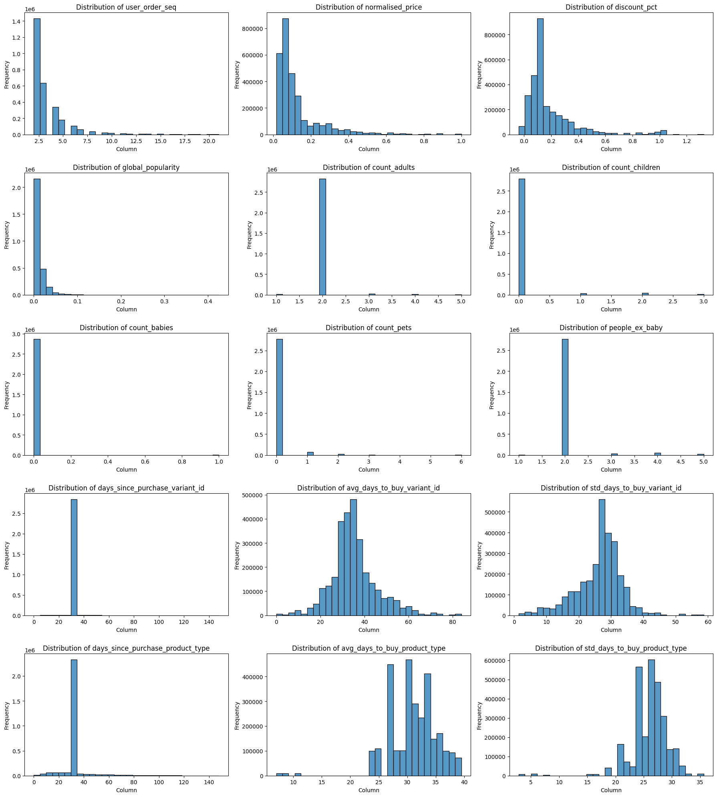
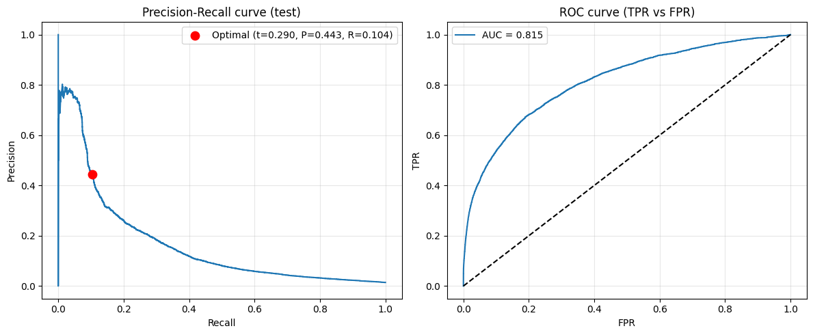

# Predictive model for analysing the probability of a user of buying a product


Author: Maria Jorda

Date: 07 Mar 2026

This notebook provides an overview of the exploratory data analysis and the evaluation of different models to infer which one is more appropriate for predicting whether a user will purchase a given product. 
We are only interested in orders with at least 5 items in the basket (sales team requirement). Train/validation/test split has been done by user to avoid data leakage.

**Conclusions:** we evaluated six logistic regression configurations (L2, L1, elasticnet with different C values) and selected the best by validation precision. The final model is LR with L1 regularisation and C=1.0, achieving ~0.64 precision on validation and ~0.44 precision / ~0.10 recall on test at the F0.5-optimal threshold. We prioritise precision because push notifications should minimise false positives (users we predict will buy but do not). We tried class_weight='balanced' to improve recall given the 1.5% positive rate, but it hurt precision too much. The decision threshold was optimised with F0.5 to favour precision over recall. The pipeline is implemented in purchase_model_mvp_20260307.py for deployment.


```python
import matplotlib.pyplot as plt
import numpy as np
import pandas as pd
import seaborn as sns
from sklearn.linear_model import LogisticRegression
from sklearn.metrics import (
    accuracy_score,
    auc,
    f1_score,
    fbeta_score,
    precision_recall_curve,
    precision_score,
    recall_score,
    roc_curve,
)
from sklearn.preprocessing import StandardScaler, TargetEncoder
from statsmodels.stats.outliers_influence import variance_inflation_factor
```

## Data download


```python
# In order to pull the data you need to have the files in a folder in the same directory as this notebook. 
# If you have the data in a different location, you can change the path in the code below.
relative_path="module_3_datasets/"
```


```python
df_orders = pd.read_csv(f'{relative_path}feature_frame.csv')
print(df_orders.shape)
df_orders.head()
```

    (2880549, 27)


<div>
<style scoped>
    .dataframe tbody tr th:only-of-type {
        vertical-align: middle;
    }

    .dataframe tbody tr th {
        vertical-align: top;
    }

    .dataframe thead th {
        text-align: right;
    }
</style>
<table border="1" class="dataframe">
  <thead>
    <tr style="text-align: right;">
      <th></th>
      <th>variant_id</th>
      <th>product_type</th>
      <th>order_id</th>
      <th>user_id</th>
      <th>created_at</th>
      <th>order_date</th>
      <th>user_order_seq</th>
      <th>outcome</th>
      <th>ordered_before</th>
      <th>abandoned_before</th>
      <th>...</th>
      <th>count_children</th>
      <th>count_babies</th>
      <th>count_pets</th>
      <th>people_ex_baby</th>
      <th>days_since_purchase_variant_id</th>
      <th>avg_days_to_buy_variant_id</th>
      <th>std_days_to_buy_variant_id</th>
      <th>days_since_purchase_product_type</th>
      <th>avg_days_to_buy_product_type</th>
      <th>std_days_to_buy_product_type</th>
    </tr>
  </thead>
  <tbody>
    <tr>
      <th>0</th>
      <td>33826472919172</td>
      <td>ricepastapulses</td>
      <td>2807985930372</td>
      <td>3482464092292</td>
      <td>2020-10-05 16:46:19</td>
      <td>2020-10-05 00:00:00</td>
      <td>3</td>
      <td>0.0</td>
      <td>0.0</td>
      <td>0.0</td>
      <td>...</td>
      <td>0.0</td>
      <td>0.0</td>
      <td>0.0</td>
      <td>2.0</td>
      <td>33.0</td>
      <td>42.0</td>
      <td>31.134053</td>
      <td>30.0</td>
      <td>30.0</td>
      <td>24.27618</td>
    </tr>
    <tr>
      <th>1</th>
      <td>33826472919172</td>
      <td>ricepastapulses</td>
      <td>2808027644036</td>
      <td>3466586718340</td>
      <td>2020-10-05 17:59:51</td>
      <td>2020-10-05 00:00:00</td>
      <td>2</td>
      <td>0.0</td>
      <td>0.0</td>
      <td>0.0</td>
      <td>...</td>
      <td>0.0</td>
      <td>0.0</td>
      <td>0.0</td>
      <td>2.0</td>
      <td>33.0</td>
      <td>42.0</td>
      <td>31.134053</td>
      <td>30.0</td>
      <td>30.0</td>
      <td>24.27618</td>
    </tr>
    <tr>
      <th>2</th>
      <td>33826472919172</td>
      <td>ricepastapulses</td>
      <td>2808099078276</td>
      <td>3481384026244</td>
      <td>2020-10-05 20:08:53</td>
      <td>2020-10-05 00:00:00</td>
      <td>4</td>
      <td>0.0</td>
      <td>0.0</td>
      <td>0.0</td>
      <td>...</td>
      <td>0.0</td>
      <td>0.0</td>
      <td>0.0</td>
      <td>2.0</td>
      <td>33.0</td>
      <td>42.0</td>
      <td>31.134053</td>
      <td>30.0</td>
      <td>30.0</td>
      <td>24.27618</td>
    </tr>
    <tr>
      <th>3</th>
      <td>33826472919172</td>
      <td>ricepastapulses</td>
      <td>2808393957508</td>
      <td>3291363377284</td>
      <td>2020-10-06 08:57:59</td>
      <td>2020-10-06 00:00:00</td>
      <td>2</td>
      <td>0.0</td>
      <td>0.0</td>
      <td>0.0</td>
      <td>...</td>
      <td>0.0</td>
      <td>0.0</td>
      <td>0.0</td>
      <td>2.0</td>
      <td>33.0</td>
      <td>42.0</td>
      <td>31.134053</td>
      <td>30.0</td>
      <td>30.0</td>
      <td>24.27618</td>
    </tr>
    <tr>
      <th>4</th>
      <td>33826472919172</td>
      <td>ricepastapulses</td>
      <td>2808429314180</td>
      <td>3537167515780</td>
      <td>2020-10-06 10:37:05</td>
      <td>2020-10-06 00:00:00</td>
      <td>3</td>
      <td>0.0</td>
      <td>0.0</td>
      <td>0.0</td>
      <td>...</td>
      <td>0.0</td>
      <td>0.0</td>
      <td>0.0</td>
      <td>2.0</td>
      <td>33.0</td>
      <td>42.0</td>
      <td>31.134053</td>
      <td>30.0</td>
      <td>30.0</td>
      <td>24.27618</td>
    </tr>
  </tbody>
</table>
<p>5 rows × 27 columns</p>
</div>


We now run the preprocessing steps (in a similar way as we did for this exercise in module 2)

## Sanity checks

### 1. Data types


```python
df_orders.dtypes
```


    variant_id                            int64
    product_type                         object
    order_id                              int64
    user_id                               int64
    created_at                           object
    order_date                           object
    user_order_seq                        int64
    outcome                             float64
    ordered_before                      float64
    abandoned_before                    float64
    active_snoozed                      float64
    set_as_regular                      float64
    normalised_price                    float64
    discount_pct                        float64
    vendor                               object
    global_popularity                   float64
    count_adults                        float64
    count_children                      float64
    count_babies                        float64
    count_pets                          float64
    people_ex_baby                      float64
    days_since_purchase_variant_id      float64
    avg_days_to_buy_variant_id          float64
    std_days_to_buy_variant_id          float64
    days_since_purchase_product_type    float64
    avg_days_to_buy_product_type        float64
    std_days_to_buy_product_type        float64
    dtype: object


We should change the datatype of 'created_at' and 'order_date' because they're datetimes. Additionally, I think it's better for boolean values to be integers, not floats, so I'll also change the data types of boolean values. To identify boolean variables we check the max and min of the variables (they should be 1 and 0 respectively) or the .value_counts() of the variables. I'll also change other float variables like 'count_adults' to integer.


```python
 
df_orders['created_at'] = pd.to_datetime(df_orders['created_at'])
df_orders['order_date'] = pd.to_datetime(df_orders['order_date'])
```


```python
boolean_columns = df_orders[['outcome', 'ordered_before', 'abandoned_before', 'active_snoozed', 'set_as_regular']]
integer_columns = df_orders[['days_since_purchase_variant_id', 'days_since_purchase_product_type', 'count_adults', 'count_children', 'count_babies', 'count_pets', 'people_ex_baby']]

for column in boolean_columns:
    df_orders[column] = df_orders[column].astype('int64')

for column in integer_columns:
    df_orders[column] = df_orders[column].astype('int64')
```

### 2. Missing values


```python
df_orders.isna().sum()
```


    variant_id                          0
    product_type                        0
    order_id                            0
    user_id                             0
    created_at                          0
    order_date                          0
    user_order_seq                      0
    outcome                             0
    ordered_before                      0
    abandoned_before                    0
    active_snoozed                      0
    set_as_regular                      0
    normalised_price                    0
    discount_pct                        0
    vendor                              0
    global_popularity                   0
    count_adults                        0
    count_children                      0
    count_babies                        0
    count_pets                          0
    people_ex_baby                      0
    days_since_purchase_variant_id      0
    avg_days_to_buy_variant_id          0
    std_days_to_buy_variant_id          0
    days_since_purchase_product_type    0
    avg_days_to_buy_product_type        0
    std_days_to_buy_product_type        0
    dtype: int64


There are no missing values.

## Data integrity checks

### 1. Distribution of numerical, non-boolean variables


```python
numerical_columns = df_orders[['user_order_seq', 'normalised_price', 'discount_pct', 'global_popularity', 'count_adults', 'count_children', 'count_babies', 'count_pets', 'people_ex_baby',
                                 'days_since_purchase_variant_id', 'avg_days_to_buy_variant_id', 'std_days_to_buy_variant_id', 'days_since_purchase_product_type', 'avg_days_to_buy_product_type', 'std_days_to_buy_product_type']]

fig, axes = plt.subplots(nrows=5, ncols=3, figsize=(18, 20))
axes = axes.flatten()

for i,column in enumerate(numerical_columns):
    sns.histplot(df_orders[column], bins=30, ax=axes[i])
    axes[i].set_title(f'Distribution of {column}')
    axes[i].set_xlabel('Column')
    axes[i].set_ylabel('Frequency')
    
plt.tight_layout()
plt.show()
```


    

    


These charts are really valuable, since we infer some characteristics of the purchases. In the first graphs we see that the common user is the one that does little amount of purchases in this e-commerce (given that 'user_order_seq' is right-skewed) and that they tend to buy cheap products, although there are users with higher loyalty values, and expensive products too. Most of the customers are 2 adults per household without kids and pets, but there are also larger families. Days since last purchase (both of variant id and product type) is around 30 (one month after previous purchase) for many cases, which seems a bit weird unless there's maybe a special discount after one month from last purchase. One thing that looks strange is that there are cases with discount_pct > 1, which would mean that the shop pays you, that makes no sense.

After reviewing all the distributions I consider that we only need to deal with the outliers of 'discount_pct', since I consider the other 'peaks' to be natural user behaviour


```python
df_orders[df_orders['discount_pct'] > 1]['discount_pct'].value_counts()
```


    discount_pct
    1.013423    17230
    1.010101     6892
    1.001431     6892
    1.006289     6892
    1.020202     3446
    1.325301     3446
    1.010050     3446
    1.006711     3446
    1.003339     3446
    1.132075     3446
    Name: count, dtype: int64


```python
df_orders['discount_pct'] = df_orders['discount_pct'].apply(lambda x: 1 if x > 1 else x)
```

## Correlations between variables


```python
plt.figure(figsize=(12, 10))

id_columns = ['user_id', 'order_id', 'variant_id']
numerical_columns = df_orders.select_dtypes(include=['int64', 'float64'])
numerical_columns = numerical_columns.drop(columns=id_columns, errors='ignore')

corr_matrix = numerical_columns.corr()
mask = np.triu(np.ones_like(corr_matrix, dtype=bool))

sns.heatmap(corr_matrix, mask=mask, annot=True, cmap='coolwarm', fmt='.2f')
plt.title('Correlation heatmap')
plt.tight_layout()
plt.show()
```


    

    


We see a high correlation between 'people_ex_baby' and 'count_adults' and 'count_children', since people excluding babies is the sum of those variables, so 'people_ex_baby' should be deleted to avoid a multicollinearity problem. Then we also see a high correlation between 'avg_days_to_buy_variant_id' and 'std_days_to_buy_variant_id' which explains a pattern when users are buying: if they buy sth regularly (avg_days_to_buy_variant_id would be low) then the std_days_to_buy_variant_id is also low because there is little variation. Same logic for 'avg_days_to_buy_product_type' and 'std_days_to_buy_product_type'. For these variables I'm going to compute the VIF to see if there is a high multicollinearity. Values of VIF higher than 10 indicate a multicollinearity issue.

From the correlation matrix we also see that the variables that have more linear relation with 'outcome' (variable to predict) are 'ordered_before', 'days_since_purchase_product_type', 'active_snoozed', and the count_ variables.


```python
X = numerical_columns.drop(columns=['outcome'], errors='ignore')
vif_data = pd.DataFrame()
vif_data['feature'] = X.columns
vif_data['VIF'] = [variance_inflation_factor(X.values, i) for i in range(X.shape[1])]
print(vif_data)
```

    /Users/mariajordamunoz/Library/Caches/pypoetry/virtualenvs/zrive-ds-Yy3t-uQX-py3.11/lib/python3.11/site-packages/statsmodels/stats/outliers_influence.py:197: RuntimeWarning: divide by zero encountered in scalar divide
      vif = 1. / (1. - r_squared_i)


                                 feature         VIF
    0                     user_order_seq    3.790808
    1                     ordered_before    1.262233
    2                   abandoned_before    1.005994
    3                     active_snoozed    1.078707
    4                     set_as_regular    1.106921
    5                   normalised_price    2.057176
    6                       discount_pct    2.011348
    7                  global_popularity    1.465968
    8                       count_adults         inf
    9                     count_children         inf
    10                      count_babies    1.085973
    11                        count_pets    1.429117
    12                    people_ex_baby         inf
    13    days_since_purchase_variant_id   62.513203
    14        avg_days_to_buy_variant_id   19.967011
    15        std_days_to_buy_variant_id   23.348515
    16  days_since_purchase_product_type    7.983033
    17      avg_days_to_buy_product_type  183.343672
    18      std_days_to_buy_product_type  214.366037


We see that the VIF is extremely high (inf) for count_adults, people_ex_baby and count_children, as people_ex_baby is explained by the other two. Additionally, days_since_purchase_variant_id, avg_days_to_buy_variant_id,std_days_to_buy_variant_id, avg_days_to_buy_product_type and std_days_to_buy_product_type also have VIF higher than 10, as days_since, avg and std are highly correlated. Keeping all variables can affect the predictive model, so I'm going to drop the std variable (the avg variable is easier to understand)


```python
df_orders.drop(columns=['people_ex_baby', 'std_days_to_buy_variant_id', 'std_days_to_buy_product_type'], inplace=True)
```

The preprocessing steps are complete. We encode categorical variables (product_type and vendor) after the train/val/test split in the modeling section, fitting the encoders on train only to avoid leakage.

## Modeling exploratory section


In this section we analyze which model fits best our goal.


```python
df_orders.dtypes
```


    variant_id                                   int64
    product_type                                object
    order_id                                     int64
    user_id                                      int64
    created_at                          datetime64[ns]
    order_date                          datetime64[ns]
    user_order_seq                               int64
    outcome                                      int64
    ordered_before                               int64
    abandoned_before                             int64
    active_snoozed                               int64
    set_as_regular                               int64
    normalised_price                           float64
    discount_pct                               float64
    vendor                                      object
    global_popularity                          float64
    count_adults                                 int64
    count_children                               int64
    count_babies                                 int64
    count_pets                                   int64
    days_since_purchase_variant_id               int64
    avg_days_to_buy_variant_id                 float64
    days_since_purchase_product_type             int64
    avg_days_to_buy_product_type               float64
    dtype: object


```python
df_orders.shape
```


    (2880549, 24)


### Filtering: orders with ≥5 purchased products only

We are only interested in baskets with at least 5 items (shipping costs for few items exceed the margin), so we filter by `order_id` where the sum of `outcome` ≥ 5.


```python
purchased_items_per_order = df_orders.groupby('order_id')['outcome'].sum()
valid_order_ids = purchased_items_per_order[purchased_items_per_order >= 5].index
df_orders_filtered = df_orders[df_orders['order_id'].isin(valid_order_ids)]
df_orders_filtered.shape
```


    (2163953, 24)


### Train / Validation / Test split by user 

With a random split, the same user could appear in both train and validation/test. The model would learn patterns from that user in train and "predict" them in validation/test, which is data leakage.

We split by user_id instead: each user goes entirely to train, validation, or test. That way we can see if the model generalizes to unseen users.


```python
# Split by user_id (avoid leakage)
unique_users = df_orders_filtered['user_id'].unique()
np.random.seed(42)
np.random.shuffle(unique_users)

# 70% train, 15% validation, 15% test
n_users = len(unique_users)
n_train = int(0.70 * n_users)
n_val = int(0.15 * n_users)

train_users = unique_users[:n_train]
val_users = unique_users[n_train:n_train + n_val]
test_users = unique_users[n_train + n_val:]

df_train = df_orders_filtered[df_orders_filtered['user_id'].isin(train_users)]
df_val = df_orders_filtered[df_orders_filtered['user_id'].isin(val_users)]
df_test = df_orders_filtered[df_orders_filtered['user_id'].isin(test_users)]

print(f"Users: train={len(train_users)}, val={len(val_users)}, test={len(test_users)}")
print(f"Rows:  train={len(df_train):,}, val={len(df_val):,}, test={len(df_test):,}")
```

    Users: train=1061, val=227, test=229
    Rows:  train=1,507,521, val=335,194, test=321,238


For choosing the predictive variables, we exclude variant_id, order_id and user_id because they are identifiers, not predictive features. We exclude outcome because it is the target. We exclude product_type and vendor as raw columns because we use their target-encoded versions (product_type_enc, vendor_enc). We exclude created_at and order_date to avoid temporal overfitting and because they may not generalise well to future data.


```python
# Target encode product_type and vendor using train data only (avoid leakage)
encoder_product = TargetEncoder(categories='auto', target_type='continuous', smooth='auto', cv=5, random_state=42)
encoder_vendor = TargetEncoder(categories='auto', target_type='continuous', smooth='auto', cv=5, random_state=42)
df_train = df_train.copy()
df_val = df_val.copy()
df_test = df_test.copy()

df_train['product_type_enc'] = encoder_product.fit_transform(df_train[['product_type']], df_train['outcome'])
df_val['product_type_enc'] = encoder_product.transform(df_val[['product_type']])
df_test['product_type_enc'] = encoder_product.transform(df_test[['product_type']])

df_train['vendor_enc'] = encoder_vendor.fit_transform(df_train[['vendor']], df_train['outcome'])
df_val['vendor_enc'] = encoder_vendor.transform(df_val[['vendor']])
df_test['vendor_enc'] = encoder_vendor.transform(df_test[['vendor']])

# Features and target (exclude ids, target, raw categoricals; we use _enc versions)
exclude_cols = ['variant_id', 'product_type', 'order_id', 'user_id', 'created_at', 'order_date', 'outcome', 'vendor']
feature_cols = [c for c in df_train.columns if c not in exclude_cols and df_train[c].dtype in ['int64', 'float64']]

X_train = df_train[feature_cols]
y_train = df_train['outcome']
X_val = df_val[feature_cols]
y_val = df_val['outcome']
X_test = df_test[feature_cols]
y_test = df_test['outcome']

# Scale features (fit on train only to avoid data leakage).
# StandardScaler standardises each feature to mean=0, std=1. We need this because Logistic regression is sensitive to 
# feature scale (variables with larger ranges would dominate). L1 regularisation also penalises coefficients by 
# magnitude, so scaling makes penalties comparable across features.
# We fit on train only and transform val/test with the same params to prevent leakage.
scaler = StandardScaler()
X_train_scaled = scaler.fit_transform(X_train)
X_val_scaled = scaler.transform(X_val)
X_test_scaled = scaler.transform(X_test)

print("Feature columns:", feature_cols)
```

    Feature columns: ['user_order_seq', 'ordered_before', 'abandoned_before', 'active_snoozed', 'set_as_regular', 'normalised_price', 'discount_pct', 'global_popularity', 'count_adults', 'count_children', 'count_babies', 'count_pets', 'days_since_purchase_variant_id', 'avg_days_to_buy_variant_id', 'days_since_purchase_product_type', 'avg_days_to_buy_product_type', 'product_type_enc', 'vendor_enc']


### Model: Logistic Regression

We use logistic regression because it fits our binary classification problem (purchase vs no purchase) and models the probability of the positive class directly. The coefficients are easy to interpret, which helps when explaining the model to stakeholders. The TDD also specifies using linear models for the POC, so logistic regression fits that requirement. It trains quickly, which is useful for the one-week deadline, and it outputs probabilities rather than just labels, so we can tune the decision threshold for the precision-recall trade-off.

We evaluate different regularisation and solver combinations. Penalty: L2 (Ridge) shrinks all coefficients; L1 (Lasso) can set some to zero, acting as feature selection; elasticnet combines both. C is the inverse of regularisation strength: smaller C means stronger regularisation. Solver: lbfgs works with L2; saga is needed for L1 and elasticnet.


```python
# Try different logistic regression models (main metric: precision)
# Precision = TP/(TP+FP): of those we predicted "will buy", how many actually bought.
# Important for push: avoid false positives (bothering users who won't buy).

configs = [
    {'penalty': 'l2', 'C': 1.0, 'solver': 'lbfgs', 'max_iter': 1000},
    {'penalty': 'l2', 'C': 0.1, 'solver': 'lbfgs', 'max_iter': 1000},
    {'penalty': 'l2', 'C': 10.0, 'solver': 'lbfgs', 'max_iter': 1000},
    {'penalty': 'l1', 'C': 1.0, 'solver': 'saga', 'max_iter': 1000},
    {'penalty': 'l1', 'C': 0.1, 'solver': 'saga', 'max_iter': 1000},
    {'penalty': 'elasticnet', 'C': 1.0, 'l1_ratio': 0.5, 'solver': 'saga', 'max_iter': 1000},
]

results = []
best_model = None
best_precision = 0
for cfg in configs:
    name = f"LR_{cfg['penalty']}_C{cfg['C']}"
    if 'l1_ratio' in cfg:
        name += f"_l1r{cfg['l1_ratio']}"
    model = LogisticRegression(random_state=42, **cfg)
    model.fit(X_train_scaled, y_train)
    y_val_pred = model.predict(X_val_scaled)
    prec = precision_score(y_val, y_val_pred, zero_division=0)
    results.append({
        'model': name,
        'precision': prec,
        'recall': recall_score(y_val, y_val_pred, zero_division=0),
        'f1': f1_score(y_val, y_val_pred, zero_division=0),
        'accuracy': accuracy_score(y_val, y_val_pred),
    })
    if prec > best_precision:
        best_precision = prec
        best_model = model

results_df = pd.DataFrame(results).sort_values('precision', ascending=False)
results_df
```


<div>
<style scoped>
    .dataframe tbody tr th:only-of-type {
        vertical-align: middle;
    }

    .dataframe tbody tr th {
        vertical-align: top;
    }

    .dataframe thead th {
        text-align: right;
    }
</style>
<table border="1" class="dataframe">
  <thead>
    <tr style="text-align: right;">
      <th></th>
      <th>model</th>
      <th>precision</th>
      <th>recall</th>
      <th>f1</th>
      <th>accuracy</th>
    </tr>
  </thead>
  <tbody>
    <tr>
      <th>3</th>
      <td>LR_l1_C1.0</td>
      <td>0.640118</td>
      <td>0.044918</td>
      <td>0.083946</td>
      <td>0.985871</td>
    </tr>
    <tr>
      <th>5</th>
      <td>LR_elasticnet_C1.0_l1r0.5</td>
      <td>0.640118</td>
      <td>0.044918</td>
      <td>0.083946</td>
      <td>0.985871</td>
    </tr>
    <tr>
      <th>0</th>
      <td>LR_l2_C1.0</td>
      <td>0.639053</td>
      <td>0.044711</td>
      <td>0.083575</td>
      <td>0.985868</td>
    </tr>
    <tr>
      <th>1</th>
      <td>LR_l2_C0.1</td>
      <td>0.639053</td>
      <td>0.044711</td>
      <td>0.083575</td>
      <td>0.985868</td>
    </tr>
    <tr>
      <th>2</th>
      <td>LR_l2_C10.0</td>
      <td>0.639053</td>
      <td>0.044711</td>
      <td>0.083575</td>
      <td>0.985868</td>
    </tr>
    <tr>
      <th>4</th>
      <td>LR_l1_C0.1</td>
      <td>0.639053</td>
      <td>0.044711</td>
      <td>0.083575</td>
      <td>0.985868</td>
    </tr>
  </tbody>
</table>
</div>


### Precision-Recall and ROC curves

We plot the Precision-Recall curve and the ROC curve (TPR vs FPR) to evaluate the model across thresholds.

The optimal threshold is chosen using F0.5, a variant of the F-score that weights precision more than recall. The general formula is:

$$F_\beta = (1 + \beta^2) \cdot \frac{\text{Precision} \cdot \text{Recall}}{\beta^2 \cdot \text{Precision} + \text{Recall}}$$

With beta = 0.5, precision is weighted more heavily than recall. This fits our goal: for push notifications we prefer to avoid false positives (bothering users who won't buy) over capturing all potential buyers.


```python
# Evaluate the best model on test: Precision-Recall and ROC curves
best_name = results_df.iloc[0]['model']
y_test_proba = best_model.predict_proba(X_test_scaled)[:, 1]

# Precision-Recall curve
precision_vals, recall_vals, thresholds_pr = precision_recall_curve(y_test, y_test_proba)
# ROC curve (TPR vs FPR)
fpr, tpr, thresholds_roc = roc_curve(y_test, y_test_proba)
roc_auc = auc(fpr, tpr)

# Optimal threshold: F0.5 favors precision over recall (beta=0.5)
# Use a grid of 101 thresholds instead of all unique values (100k+ caused 60 min runtime)
thresholds_grid = np.linspace(0, 1, 101)
f05_scores = np.array([fbeta_score(y_test, (y_test_proba >= t).astype(int), beta=0.5, zero_division=0) for t in thresholds_grid])
best_threshold = thresholds_grid[np.argmax(f05_scores)]
y_test_pred_opt = (y_test_proba >= best_threshold).astype(int)
prec_opt = precision_score(y_test, y_test_pred_opt, zero_division=0)
rec_opt = recall_score(y_test, y_test_pred_opt, zero_division=0)

fig, axes = plt.subplots(1, 2, figsize=(12, 5))
axes[0].plot(recall_vals, precision_vals)
axes[0].scatter([rec_opt], [prec_opt], color='red', s=80, zorder=5, label=f'Optimal (t={best_threshold:.3f}, P={prec_opt:.3f}, R={rec_opt:.3f})')
axes[0].set_xlabel('Recall')
axes[0].set_ylabel('Precision')
axes[0].set_title('Precision-Recall curve (test)')
axes[0].legend()
axes[0].grid(True, alpha=0.3)

axes[1].plot(fpr, tpr, label=f'AUC = {roc_auc:.3f}')
axes[1].plot([0, 1], [0, 1], 'k--')
axes[1].set_xlabel('FPR')
axes[1].set_ylabel('TPR')
axes[1].set_title('ROC curve (TPR vs FPR)')
axes[1].legend()
axes[1].grid(True, alpha=0.3)
plt.tight_layout()
plt.show()

print(f"Best model: {best_name}")
print(f"Optimal threshold (F0.5, favors precision): {best_threshold:.4f}")
print(f"At this threshold: Precision={prec_opt:.4f}, Recall={rec_opt:.4f}")
```


    

    


    Best model: LR_l1_C1.0
    Optimal threshold (F0.5, favors precision): 0.2900
    At this threshold: Precision=0.4431, Recall=0.1038


We tried class_weight='balanced' to address the low recall caused by the 1.5% positive rate. With balanced weights, recall increased to 0.62 but precision dropped to 0.05 at the default threshold, and 0.31 at the optimal threshold. For push notifications we need high precision to avoid bothering users who will not buy, so we use the default (no class weighting). The trade-off is lower recall, but precision around 0.44–0.63 is more suitable for our use case.

## Final model selection

The chosen model is the one with the highest precision on the validation set. We prioritise precision because push notifications should minimise false positives, i.e. users we predict will buy but who do not. The model was evaluated on the test set (unseen users) using Precision-Recall and ROC curves, and the decision threshold was optimised with F0.5 to favour precision.


```python
# Summary: chosen model and rationale
print("FINAL MODEL SELECTION")
print(f"Model: {best_name}")
print(f"Validation precision: {results_df.iloc[0]['precision']:.4f}")
print(f"Test set (at F0.5 threshold {best_threshold:.4f}): Precision={prec_opt:.4f}, Recall={rec_opt:.4f}")
```

    FINAL MODEL SELECTION
    Model: LR_l1_C1.0
    Validation precision: 0.6401
    Test set (at F0.5 threshold 0.2900): Precision=0.4431, Recall=0.1038


To decide which model fitted best our purpose, we evaluated six logistic regression configs (L2, L1, elasticnet with different C values) and selected the best by validation precision. We tried class_weight='balanced' to improve recall given the 1.5% positive rate, but it hurt precision too much for our use case. The final model is LR_l1_C1.0, with 0.64 precision on validation and 0.44 precision / 0.10 recall on test at the F0.5-optimal threshold. We prioritise precision because push notifications should minimise false positives. The pipeline is implemented in purchase_model_mvp_20260307.py for deployment.
